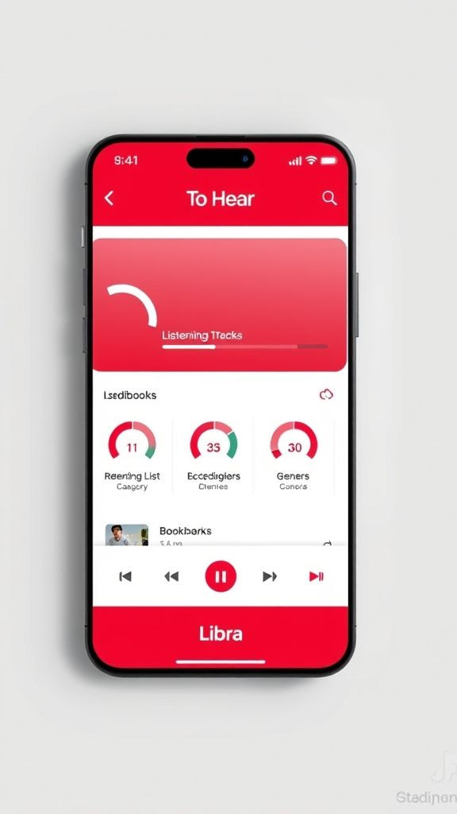
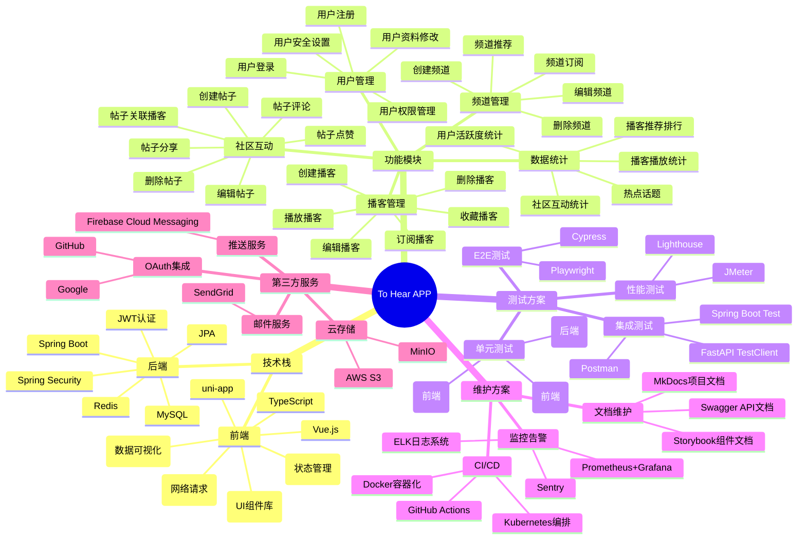
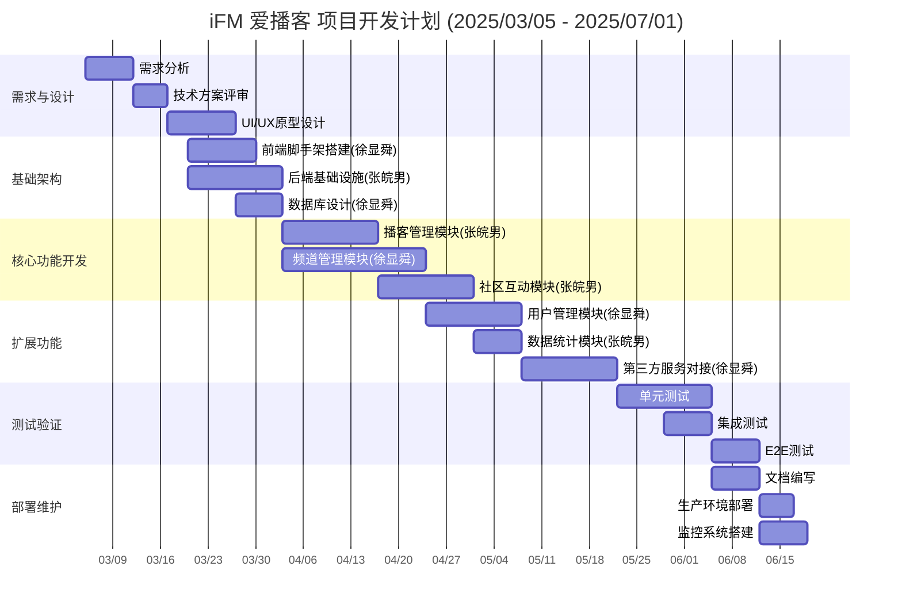

  # To Hear 应用程序 
  
   ## 项目介绍 
  
   本项目是基于uni-app + Vue3 + Typescript + Pinia + Vite的TOHEARAPP，后端使用SpringBoot+Maven + MyBatis+MySQL，其主要功能是：

  - 热门内容推荐：通过算法推荐，实时推送用户感兴趣的播客内容，提升用户粘性
- 多种精彩呈现：用户可以根据频道订阅播客节目，支持收听、收藏功能，满足个性化需求
- 社区互动：设计了丰富的社交互动功能，帖子代替评论，增强播客内容与社区内容的关联性，提升用户参与度
- 简单快捷的创作功能：通过创作中心，用户可以轻松创作播客节目或社区帖子，降低创作门槛
- 数据安全保障：提供邮箱验证安全措施，确保用户数据安全

  
   
  
   ## 小组成员及分工 
  
   |姓名 | 学号 | 分工 | 
  |----------------------------------- |------------ |------------------------ | 
  | [徐显舜]（https://github.com/Pleaseboss） | 2212190527 | 前端核心开发+拓展模块+数据库 | 
  | [张皖男]（https://github.com/wnzhang） | 2212190106 | 后端服务+基础设施 | 
  
  ## 项目结构

## 项目计划

  
   
 
