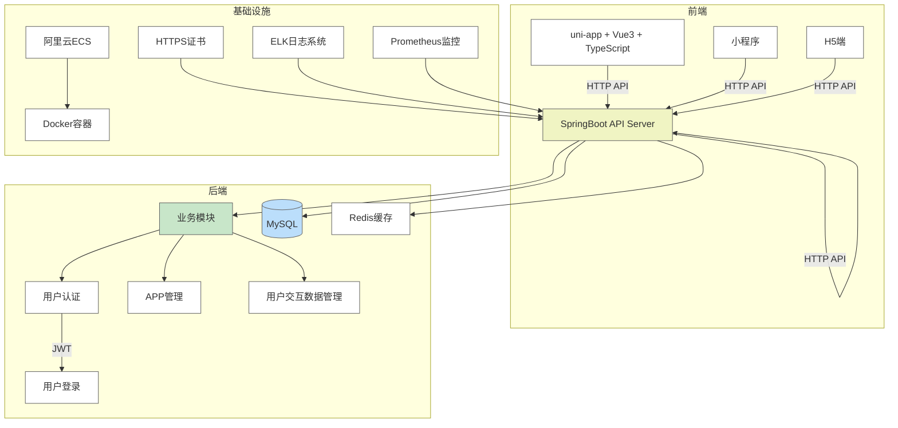
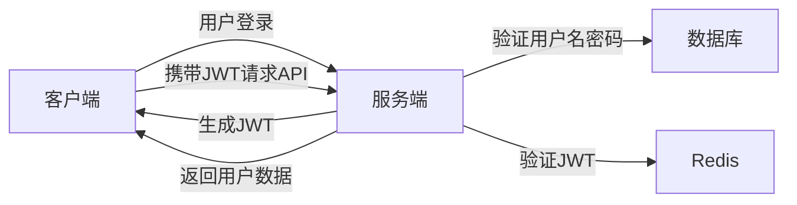
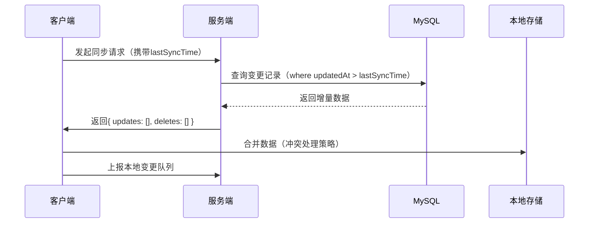

# 系统架构

## 技术栈选择依据：

1. **服务端**：
  - **SpringBoot**：简洁的配置方式、快速开发、广泛的社区支持、与 MyBatis 无缝集成，适合构建高效的 RESTful API。
  - **MyBatis**：灵活的 SQL 映射工具，便于控制复杂查询，同时与 SpringBoot 配合良好，适合业务逻辑驱动的项目。
  - **MySQL**：稳定的关系型数据库，适合存储结构化数据，如用户信息、听书内容、评论等。
  - **Redis**：高效的缓存解决方案，用于缓存用户交互数据和提高查询性能。
  - **JWT**：无状态的用户认证方式，结合用户登录信息实现跨平台的身份验证。

2. **前端**：
  - **uni-app**：跨平台开发框架，支持 Web、App、小程序等平台的统一开发，极大提高开发效率。
  - **Vue3**：响应式数据绑定，组件化开发，提高开发效率和代码可维护性。
  - **TypeScript**：提供静态类型检查，增强代码的可维护性、可扩展性以及开发效率。
  - **Pinia**：Vue3 状态管理库，简洁的 API 设计，便于管理应用的全局状态。
  - **Vite**：快速构建工具，支持热更新、模块化开发，提高前端开发效率。

3. **移动端**：
  - **uni-app**：支持多端适配，能够同时开发 iOS、Android、H5、小程序等平台的应用，减少重复开发工作。

4. **基础设施**：
  - **Docker**：容器化部署，确保应用在不同环境下的一致性，简化开发和部署流程。
  - **阿里云ECS**：可靠的云服务器，支持项目的高效部署和扩展。
  - **HTTPS**：确保客户端与服务器之间的通信安全。
  - **ELK日志系统**：集中式日志管理，便于跟踪和分析应用的运行情况。
  - **Prometheus监控**：实时监控系统的性能，确保高可用性和性能稳定。

## 关键架构设计：

1. **用户认证与授权流程**：

2. **数据同步与增量更新**：

3. **性能优化措施**：
   - **缓存机制**：使用 Redis 缓存用户常用数据（如听书列表、用户信息等），减少数据库访问频率。
   - **分页加载**：对于听书列表、评论等数据，采用分页加载，提升加载速度，减少内存占用。
   - **图片懒加载**：图片资源采用懒加载，避免一次性加载大量图片，提升页面渲染速度。
   - **异步加载**：API 请求采用异步加载，减少 UI 阻塞，提高用户体验。
