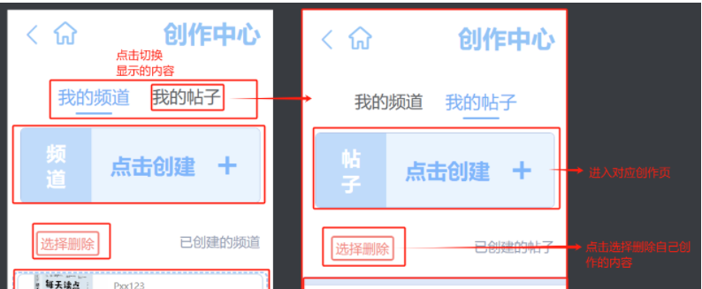
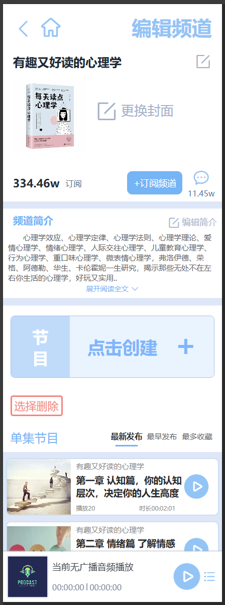
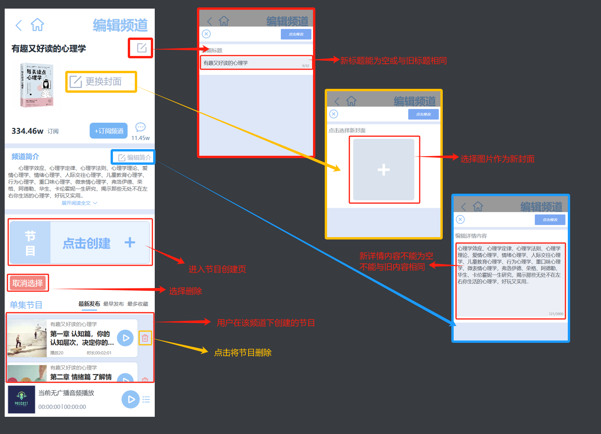
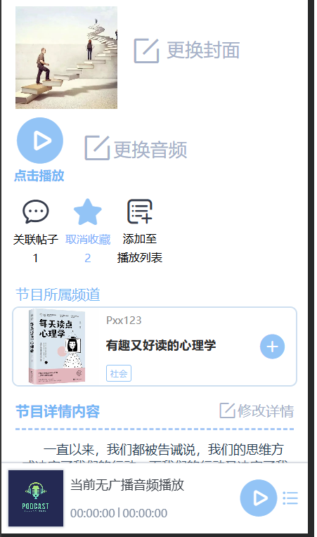
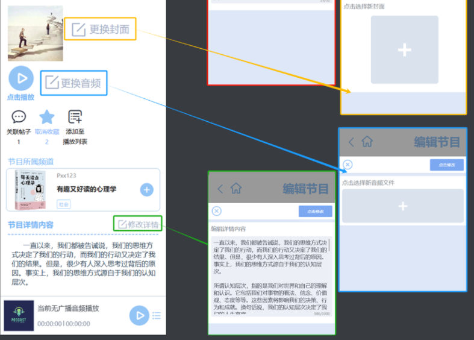
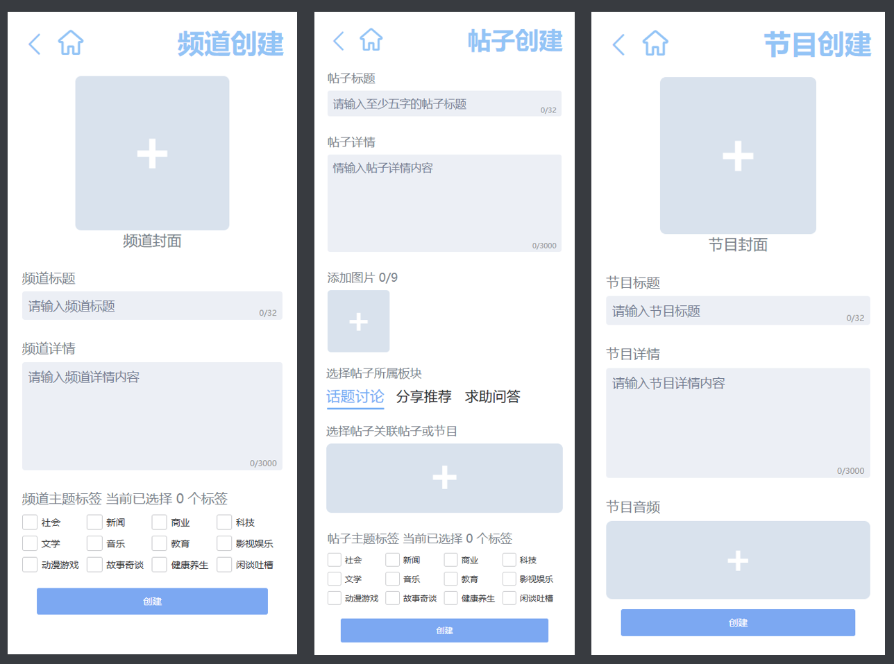
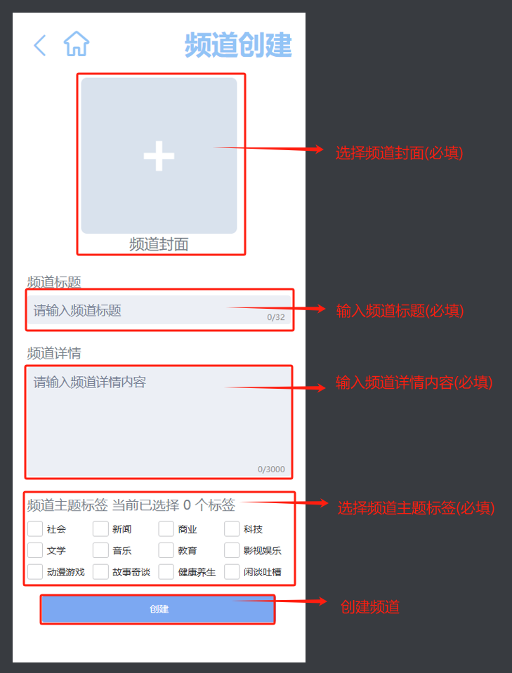
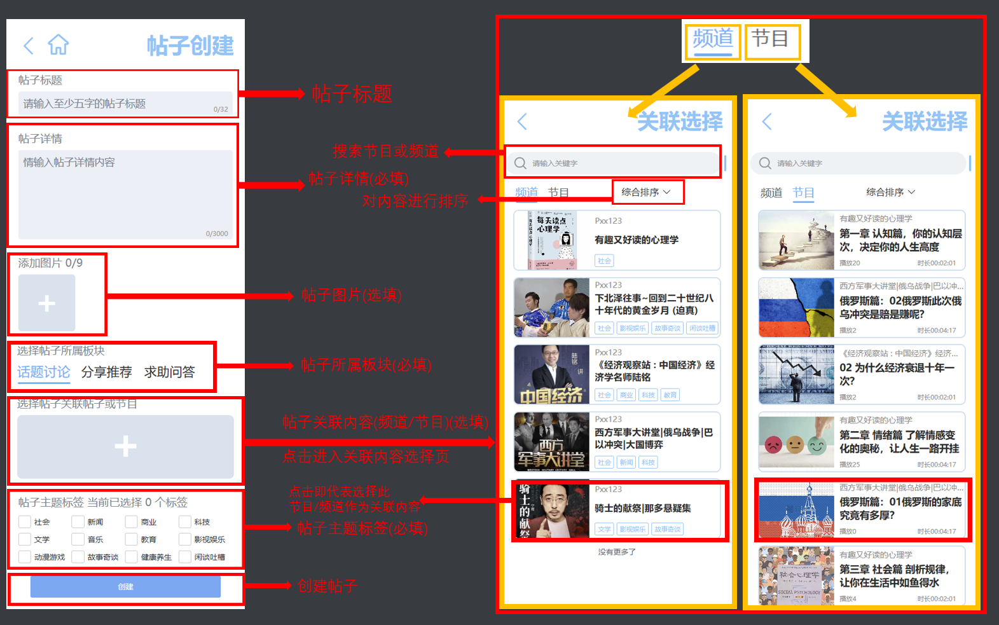
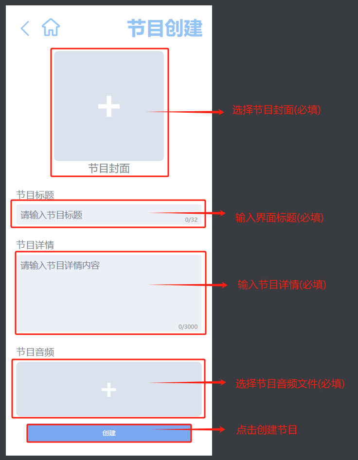

# TOHEAR最终产品说明(4)

创作中心+频道创建页+帖子创建页+节目创建页+可编辑频道页+可编辑节目页

### 创作中心

**说明:**

只有在登录后才能进入此界面

可在此界面管理自己创建的内容, 进入创作页

**在此界面点击的频道项, 进入的是可编辑频道项**

------

### 可编辑频道页

**说明:**

用户可在此界面查看修改自己创建的频道, 以及用户在频道下创建的节目

在此界面点击节目项, 将进入可编辑节目详情页

------

### 可编辑节目详情页

**说明:**

用户可在此界面查看和编辑自己创建的节目

------

### 内容创建页(频道, 帖子, 节目)

**说明:**

- 频道创建

  

- 帖子创建

  

- 节目创建

  