# TOHEAR最终产品说明(1)

首页+频道分类页+详情页+播放页说明

### 频道项

**说明:**

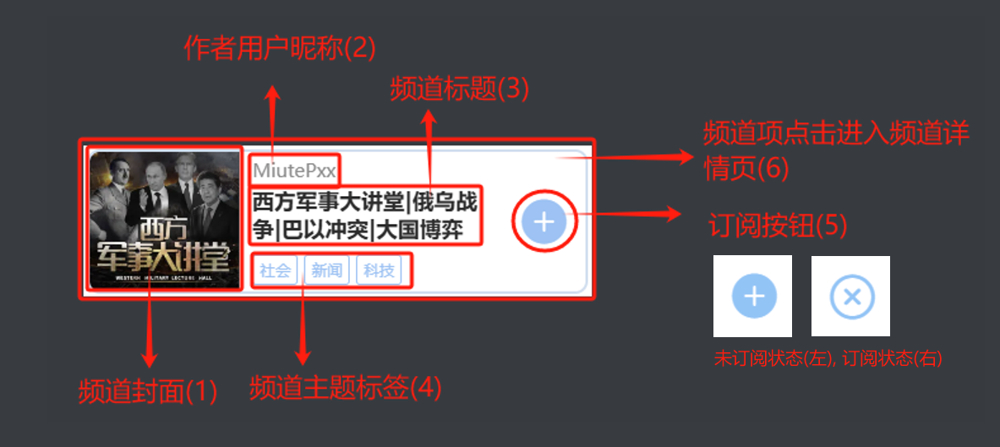

- **订阅按钮(5):**未登录状态点击提醒用户登录后操作:

  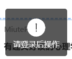

  登录状态下点击,用户 订阅/取消订阅 频道,  客户端提醒用户操作成功:

  

  

- **点击频道项进入频道详情页(6):**

  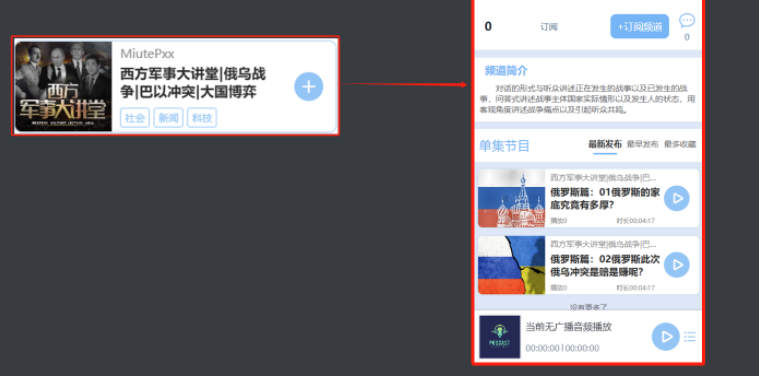

------

### 节目项

**说明:**

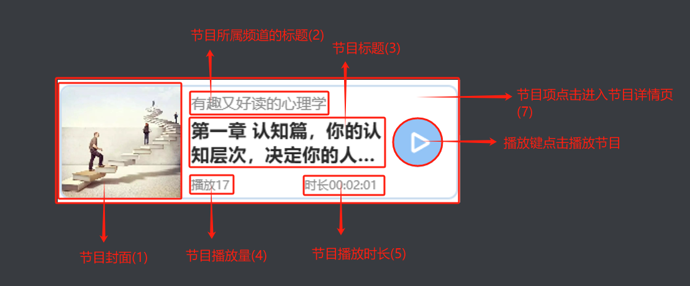

- **播放键点击播放节目(6):**点击后, 该节目加入播放列表, 播放器开始播放节目的音频, 节目播放量加一, 若用户有该节目收听历史记录, 则自动从上次收听到的位置播放, 若再次点击此播放键则重新播放该节目

- **节目项点击进入节目详情页(7):**

  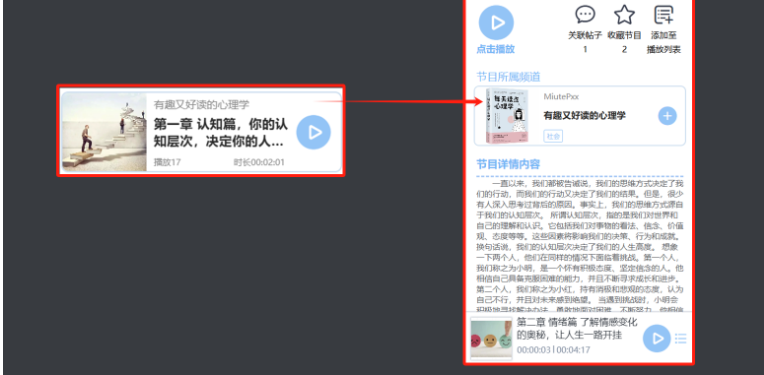

------

### 底部播放栏

**说明:**

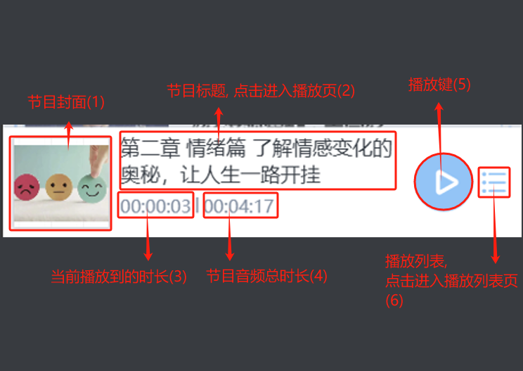

- **节目标题, 点击进入播放页(2):**

  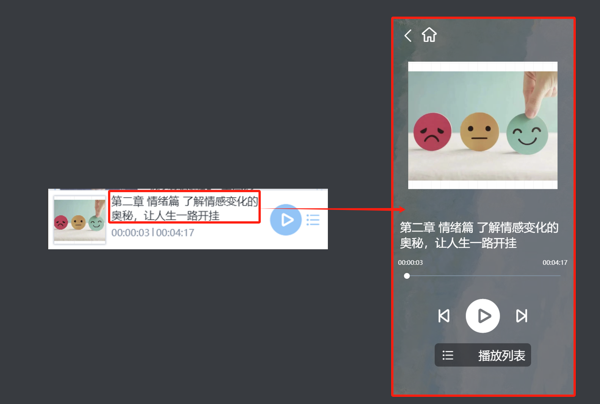

- **当前播放的节目时长(3):**显示当前播放的时长, 若非暂停情况下且用户已经登录, 则没播放15s保存一次收听历史记录

- **播放键(5):**

  若当前无节目播放, 点击提示用户"当前未播放节目"

  

  若当前有节目播放, 点击可 暂停/播放 节目音频

  

- **播放列表,点击进入播放列表页:**

  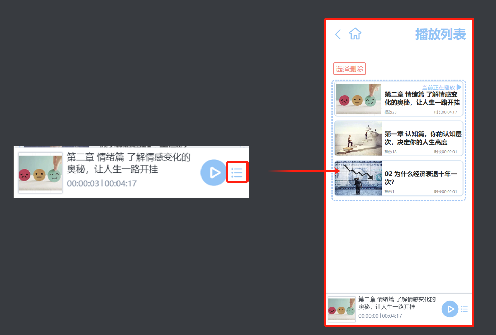

------

### 搜索栏

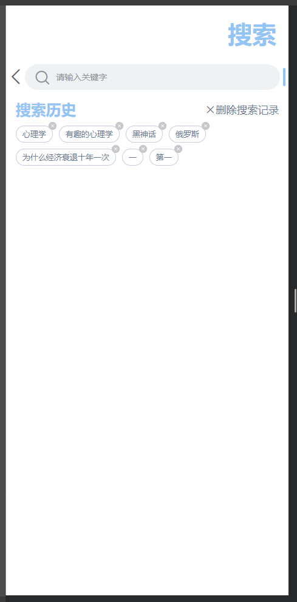

**说明:**

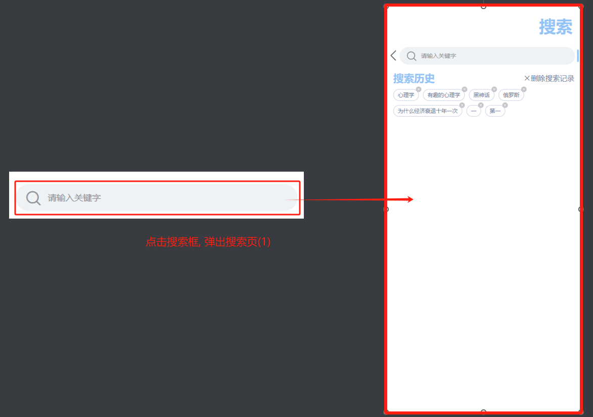

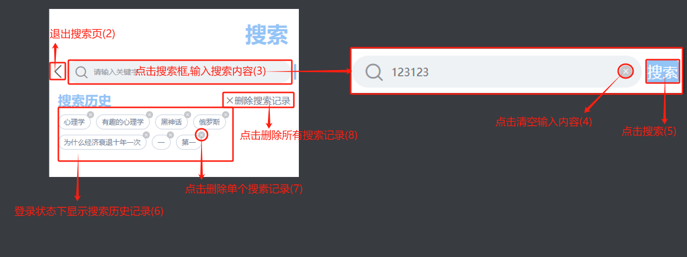

------

### 底部导航栏

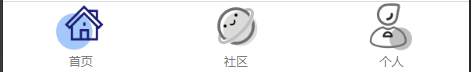

**说明:**

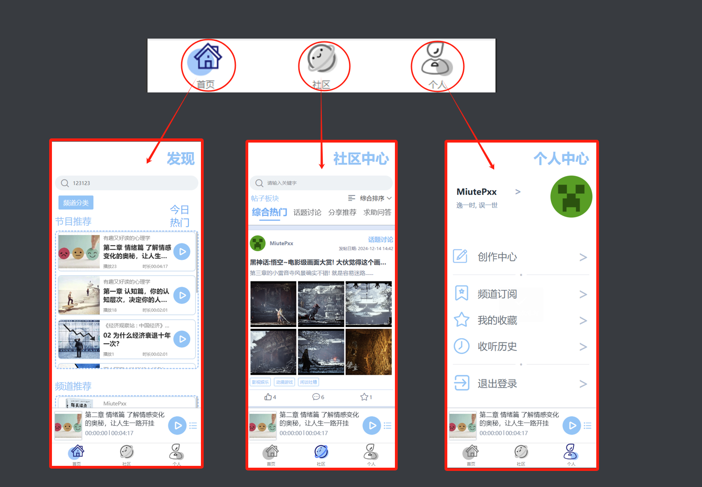

------

### 首页

**说明:**

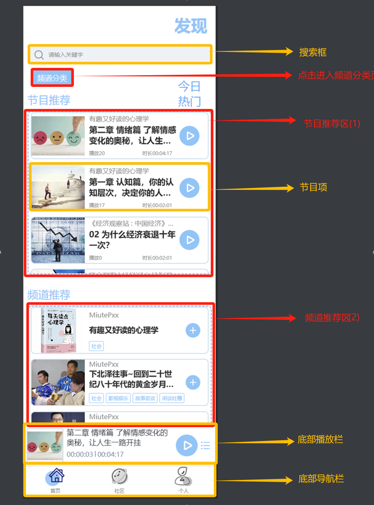

- **节目推荐区(1):**后端根据热门节目推荐算法, 将符合条件的节目项罗列在此区域
- **频道推荐区(2):**后端根据热门频道推荐算法, 将符合条件的节目项罗列在此区域

------

### 频道分类页

**说明:**

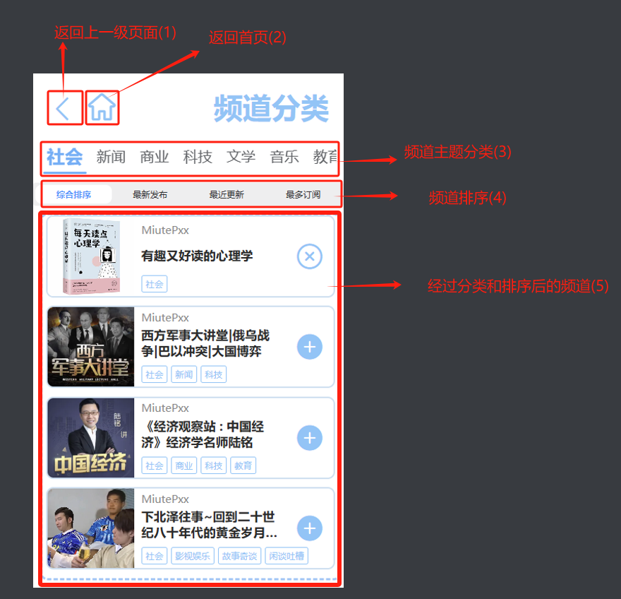

------

### 频道详情页

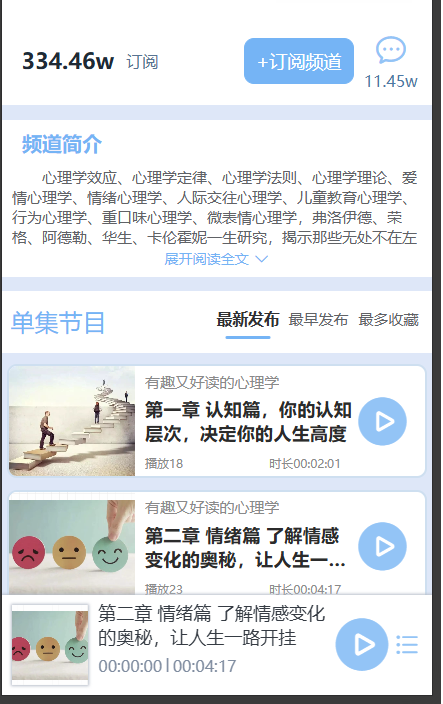

**说明:**

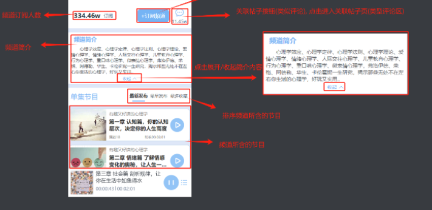

------

### 节目详情页

**说明:**

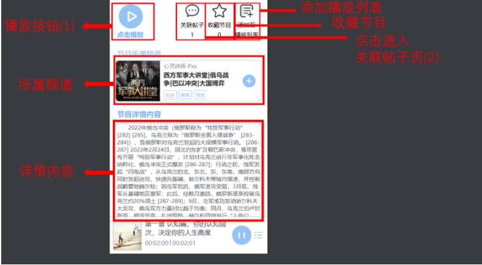

**播放按钮(1):**点击后, 该节目加入播放列表, 播放器开始播放节目的音频, 节目播放量加一, 若用户有该节目收听历史记录, 则自动从上次收听到的位置播放, 若再次点击此播放键则重新播放该节目

**点击进入关联帖子页(2):**

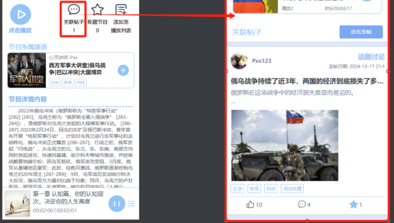

------

### 播放页, 播放列表页

**说明:**

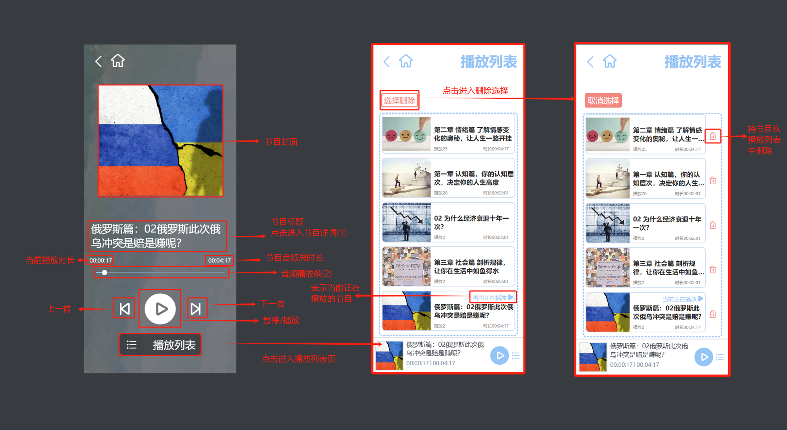