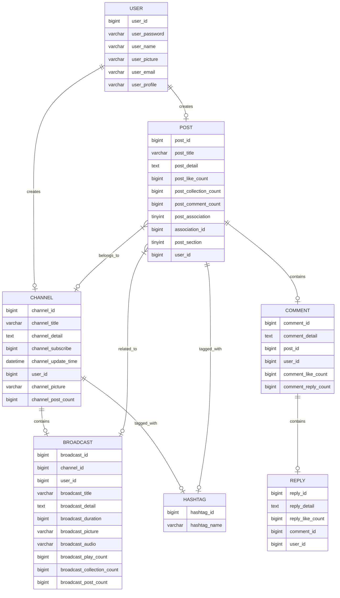

# 数据表说明

## 1. 用户表 (user)

| 字段          | 类型         | 说明           |
| ------------- | ------------ | -------------- |
| user_id       | bigint       | 用户ID(主键)   |
| user_password | varchar(30)  | 用户密码       |
| user_name     | varchar(30)  | 用户昵称(唯一) |
| user_picture  | varchar(255) | 用户头像路径   |
| user_email    | varchar(255) | 用户邮箱(唯一) |
| user_profile  | varchar(50)  | 个人简介       |

## 2. 频道表 (channel)

| 字段                | 类型         | 说明                   |
| ------------------- | ------------ | ---------------------- |
| channel_id          | bigint       | 频道ID(主键)           |
| channel_title       | varchar(32)  | 频道标题               |
| channel_detail      | text         | 频道详情内容           |
| channel_subscribe   | bigint       | 频道订阅数             |
| channel_update_time | datetime     | 频道上次更新节目的时间 |
| user_id             | bigint       | 频道作者的用户ID       |
| channel_picture     | varchar(255) | 频道封面图片路径       |
| channel_post_count  | bigint       | 频道关联帖子数         |

## 3. 广播节目表 (broadcast)

| 字段                       | 类型         | 说明                 |
| -------------------------- | ------------ | -------------------- |
| broadcast_id               | bigint       | 广播节目ID(主键)     |
| channel_id                 | bigint       | 所属频道ID           |
| user_id                    | bigint       | 作者的用户ID         |
| broadcast_title            | varchar(32)  | 广播节目标题         |
| broadcast_detail           | text         | 广播节目详情内容     |
| broadcast_duration         | bigint       | 广播节目时长(秒)     |
| broadcast_picture          | varchar(255) | 广播节目封面图片路径 |
| broadcast_audio            | varchar(255) | 广播音频文件路径     |
| broadcast_play_count       | bigint       | 广播节目播放量       |
| broadcast_collection_count | bigint       | 广播收藏量           |
| broadcast_post_count       | bigint       | 广播关联帖子数       |

## 4. 帖子表 (post)

| 字段                  | 类型        | 说明                                           |
| --------------------- | ----------- | ---------------------------------------------- |
| post_id               | bigint      | 帖子ID(主键)                                   |
| post_title            | varchar(32) | 帖子标题                                       |
| post_detail           | text        | 帖子详情内容                                   |
| post_like_count       | bigint      | 帖子点赞数                                     |
| post_collection_count | bigint      | 帖子收藏数                                     |
| post_comment_count    | bigint      | 帖子评论数                                     |
| post_association      | tinyint     | 帖子关联类型(0:频道,1:节目,-1:无)              |
| association_id        | bigint      | 关联的频道或节目ID                             |
| post_section          | tinyint     | 帖子所属板块(0:话题讨论,1:分享推荐,2:求助问答) |
| user_id               | bigint      | 发帖的用户ID                                   |

## 5. 评论表 (comment)

| 字段                | 类型   | 说明             |
| ------------------- | ------ | ---------------- |
| comment_id          | bigint | 评论ID(主键)     |
| comment_detail      | text   | 评论的文本内容   |
| post_id             | bigint | 评论所在的帖子ID |
| user_id             | bigint | 评论者的用户ID   |
| comment_like_count  | bigint | 评论的点赞数     |
| comment_reply_count | bigint | 评论回复数       |

## 6. 回复表 (reply)

| 字段             | 类型   | 说明             |
| ---------------- | ------ | ---------------- |
| reply_id         | bigint | 回复评论ID(主键) |
| reply_detail     | text   | 回复内容         |
| reply_like_count | bigint | 回复的点赞数     |
| comment_id       | bigint | 评论ID           |
| user_id          | bigint | 回复者的用户ID   |

## 7. 主题标签表 (hashtag)

| 字段         | 类型        | 说明             |
| ------------ | ----------- | ---------------- |
| hashtag_id   | bigint      | 主题标签ID(主键) |
| hashtag_name | varchar(10) | 主题标签名       |

## 8. 频道-标签关联表 (channel_hashtag)

| 字段               | 类型        | 说明       |
| ------------------ | ----------- | ---------- |
| channel_hashtag_id | bigint      | 表ID(主键) |
| channel_id         | bigint      | 频道ID     |
| hashtag_id         | bigint      | 主题标签ID |
| hashtag_name       | varchar(10) | 主题标签名 |

## 9. 帖子-标签关联表 (post_hashtag)

| 字段            | 类型        | 说明       |
| --------------- | ----------- | ---------- |
| post_hashtag_id | bigint      | 表ID(主键) |
| post_id         | bigint      | 帖子ID     |
| hashtag_id      | bigint      | 主题标签ID |
| hashtag_name    | varchar(10) | 主题标签名 |

## 10. 频道订阅表 (channel_subscription)

| 字段                    | 类型   | 说明               |
| ----------------------- | ------ | ------------------ |
| channel_subscription_id | bigint | 频道订阅表ID(主键) |
| channel_id              | bigint | 频道ID             |
| user_id                 | bigint | 用户ID             |

## 11. 节目收藏表 (broadcast_favorite)

| 字段                  | 类型   | 说明               |
| --------------------- | ------ | ------------------ |
| broadcast_favorite_id | bigint | 节目收藏表ID(主键) |
| broadcast_id          | bigint | 节目ID             |
| user_id               | bigint | 用户ID             |

## 12. 收听历史表 (broadcast_history)

| 字段                 | 类型     | 说明               |
| -------------------- | -------- | ------------------ |
| broadcast_history_id | bigint   | 收听历史表ID(主键) |
| broadcast_id         | bigint   | 节目ID             |
| user_id              | bigint   | 用户ID             |
| history_time         | datetime | 上次收听的时间     |
| last_listen_duration | bigint   | 上次收听时长(秒)   |

## 13. 帖子收藏表 (post_favorite)

| 字段             | 类型   | 说明               |
| ---------------- | ------ | ------------------ |
| post_favorite_id | bigint | 帖子收藏表ID(主键) |
| post_id          | bigint | 帖子ID             |
| user_id          | bigint | 用户ID             |

## 14. 帖子图片表 (post_image)

| 字段            | 类型         | 说明       |
| --------------- | ------------ | ---------- |
| post_picture_id | bigint       | 表ID(主键) |
| post_id         | bigint       | 帖子ID     |
| image           | varchar(255) | 图片路径   |

## 15. 评论图片表 (comment_image)

| 字段               | 类型         | 说明       |
| ------------------ | ------------ | ---------- |
| comment_picture_id | bigint       | 表ID(主键) |
| comment_id         | bigint       | 评论ID     |
| comment_image      | varchar(255) | 图片路径   |

## 16. 搜索历史表 (search_history)

| 字段              | 类型         | 说明             |
| ----------------- | ------------ | ---------------- |
| search_history_id | bigint       | 搜索记录ID(主键) |
| keyword           | varchar(255) | 搜索关键词       |
| user_id           | bigint       | 用户ID           |

---

## 索引设计

- **用户表**：
  - 主键：`user_id`
  - 唯一索引：`user_email`, `user_name`
  
- **频道表**：
  - 主键：`channel_id`
  - 外键：`user_id`（关联用户表）
  
- **广播节目表**：
  - 主键：`broadcast_id`
  - 外键：`channel_id`（关联频道表），`user_id`（关联用户表）

- **帖子表**：
  - 主键：`post_id`
  - 外键：`user_id`（关联用户表）
  - 索引：`association_id + post_association`（用于关联查询）

- **评论表**：
  - 主键：`comment_id`
  - 外键：`post_id`（关联帖子表），`user_id`（关联用户表）

- **回复表**：
  - 主键：`reply_id`
  - 外键：`comment_id`（关联评论表），`user_id`（关联用户表）

- **多对多关联表**：
  - 设置了联合唯一索引，防止重复关联

---

## 业务逻辑说明

### 用户系统：
- 用户可创建频道、发布广播节目、发帖、评论和回复
- 用户可订阅频道、收藏节目和帖子

### 内容系统：
- 频道包含多个广播节目
- 帖子可关联频道或广播节目
- 内容通过主题标签进行分类

### 互动系统：
- 用户可点赞帖子、评论和回复
- 系统记录用户的收听历史和搜索历史

### 多媒体支持：
- 支持上传图片（用户头像、频道封面、节目封面、帖子图片、评论图片）
- 支持上传音频文件（广播节目）

这个数据库设计支持一个完整的音频分享社区平台，包含用户管理、内容发布、社交互动等功能。