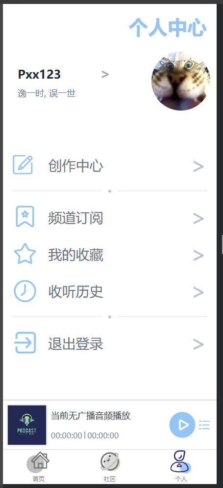
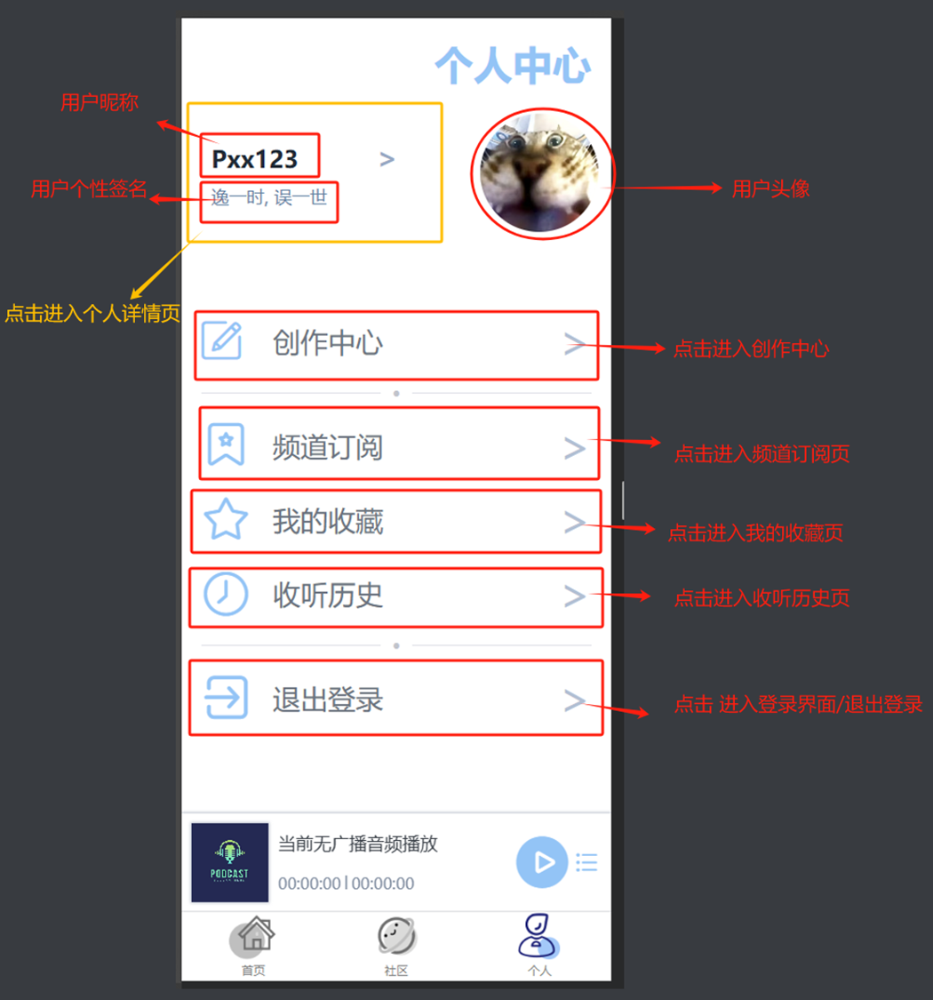
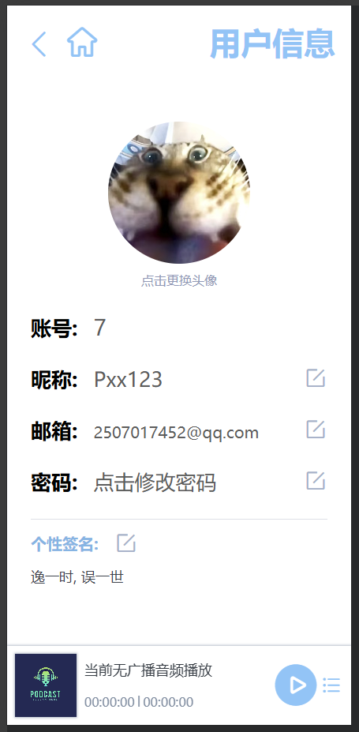
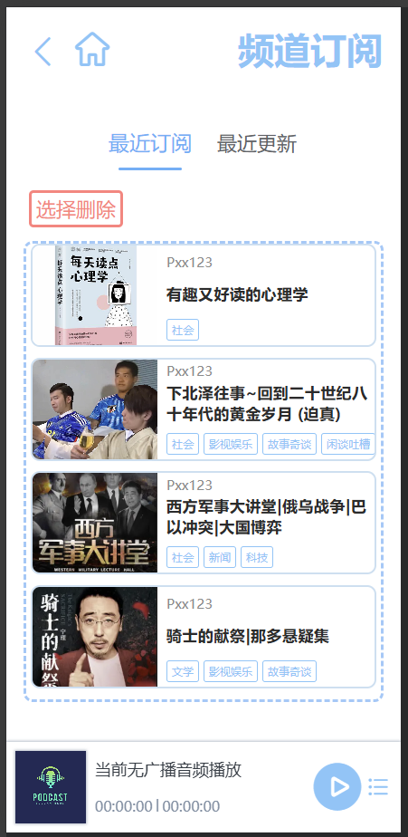
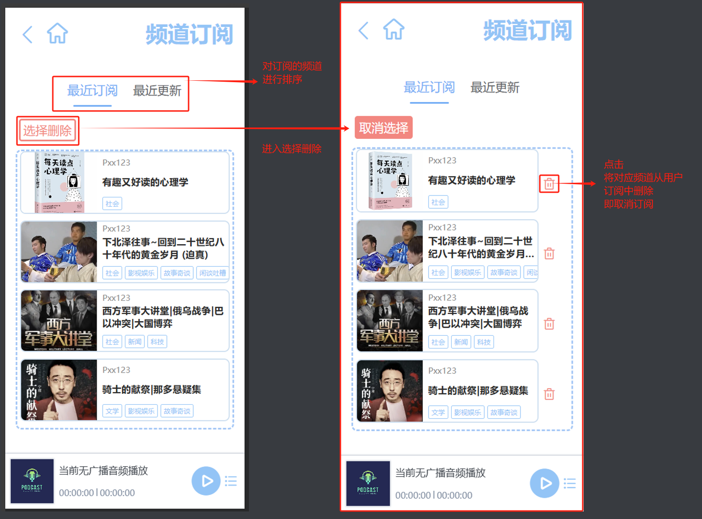
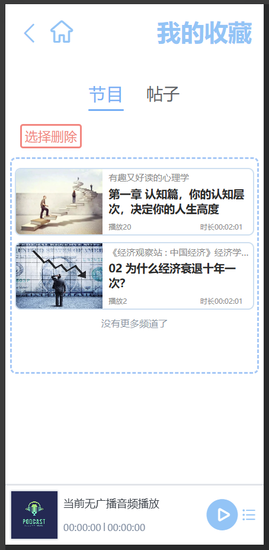
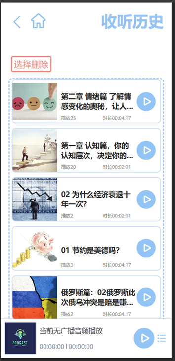
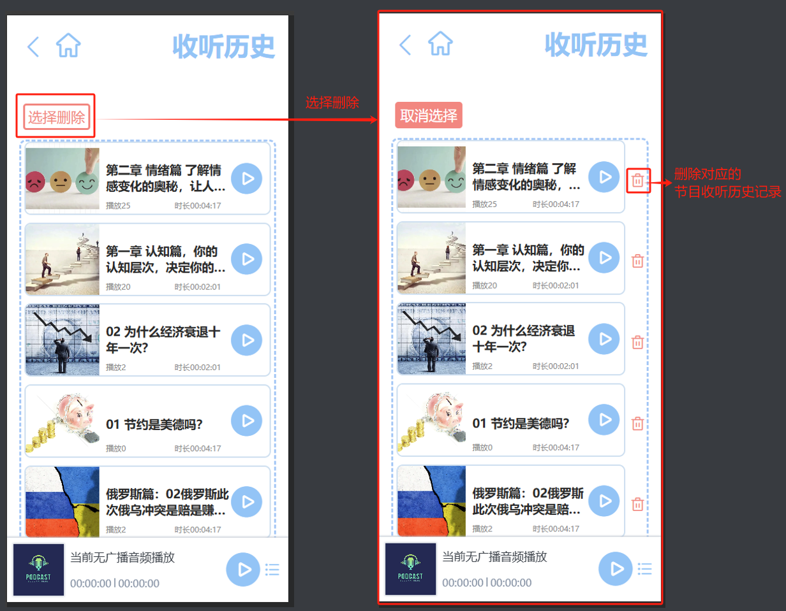
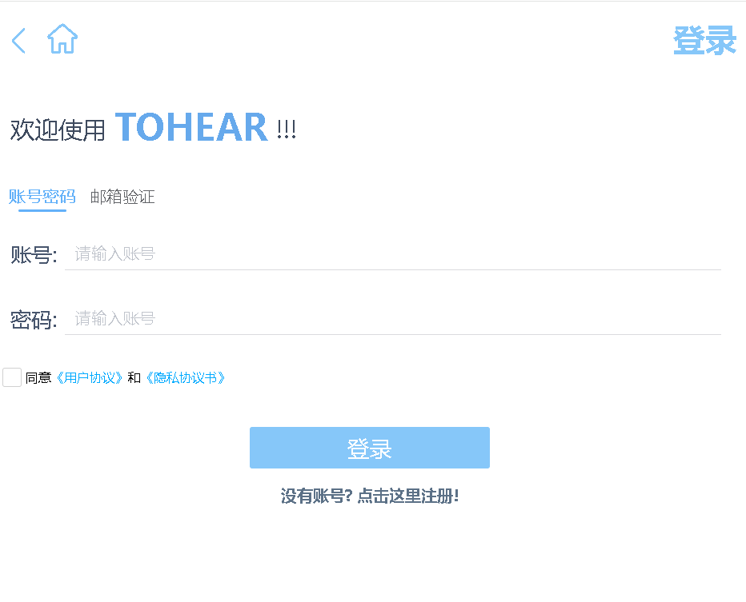
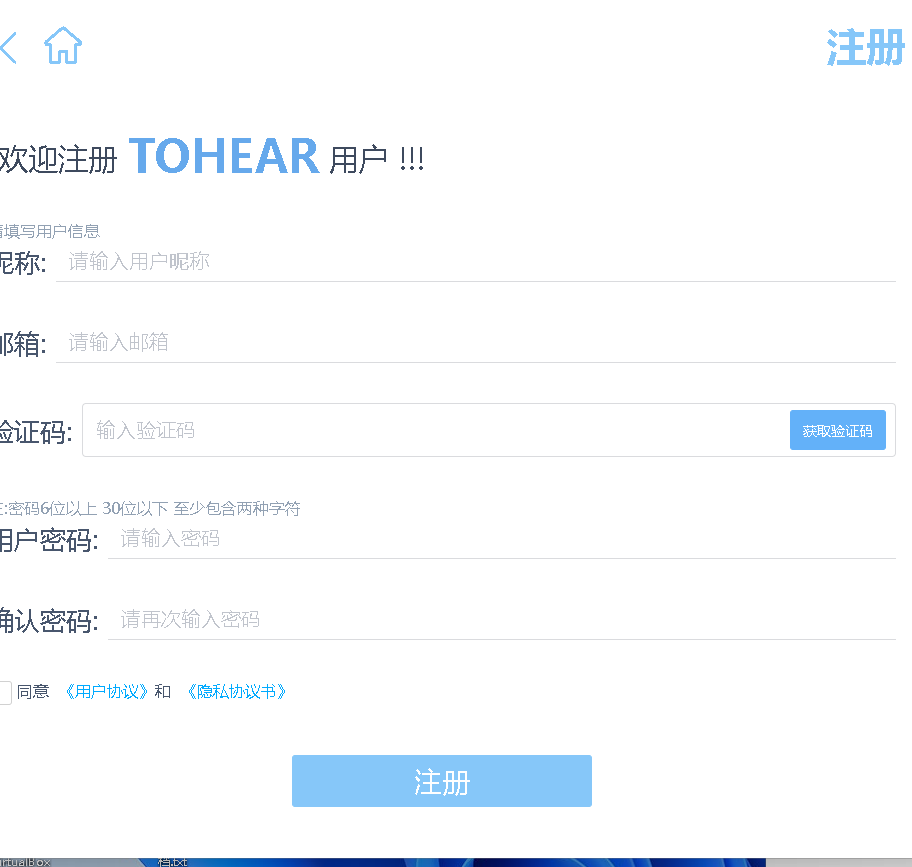

# TOHEAR最终产品说明(3)

个人中心页+个人详情页+频道订阅+我的收藏+收听历史+用户界面+登录界面+注册界面

### 个人中心

**说明:**

------

### 个人详情页

除了账号外, 用户可更改用户信息, 点击对应的编辑按钮, 即可弹出对应弹窗, 用户填入完整且正确可用的信息, 点击确认修改即可

------

### 频道订阅页

**说明:**

显示用户订阅频道

------

### 我的收藏

------

### 收听历史页

**说明:**

在收听历史页中, 会显示用户此前收听的节目

------

### 登录界面

------

### 注册界面

**说明:**

- 所有输入框都是必填项
- 昵称不能是其他用户注册过的
- 邮箱不能是其他用户注册过的
- 邮箱格式必须正确, 且邮箱存在, 点击"获取验证码"后才会向其发送验证码
- 用户密码至少6位以上, 30为以下, 至少包含两种字符(数字, 字母, 特殊符号)
- 必须勾选"同意《用户协议》和《隐私协议书》"才能注册