# TOHEAR产品设计文档

- 第七组
- 徐显舜 张皖男
- 产品名：TOHEAR听书


# 一、项目介绍 [徐显舜]

## 1.1 背景与问题陈述

在当今信息快速发展的时代，播客成为一种受欢迎的内容传播方式。传统音频平台存在内容零散、交互单一、个性化推荐不足等问题。

TOHEAR听书 APP 是一款基于小程序平台的社区化网络音频分享应用，旨在为用户和内容生产者共建生态平台，提供契合当代播客听众的「收听」和「社区」体验。用户可以通过这款软件发现喜欢的播客节目，发布帖子进行讨论，找到品味相似的同好，亦可以在这款软件上传自己的播客节目。

## 1.2 项目目标与价值

本项目的目标是打造一个简洁、流畅、功能完备的播客收听与分享平台。其核心价值包括：

- 提供高效的音频内容获取与播放体验
- 支持用户注册、登录、收藏、评论等交互功能
- 支持后端内容管理与数据分析，便于系统维护和优化
- 面向移动端设计，提升用户便捷使用体验

## 1.3 功能需求分析

### 功能性需求

1. **用户管理功能**
   - 用户注册、登录、登出
   - 用户个人信息查看与编辑
2. **播客内容管理**
   - 播客音频上传、删除、分类管理
   - 播客内容的浏览、收藏、点赞、评论
   - 播客播放记录、历史记录保存
3. **搜索与推荐**
   - 支持关键词搜索播客
   - 首页推荐热门播客/新上架内容
4. **社交互动**
   - 播客评论功能
   - 用户关注/取消关注功能

### 非功能性需求

- **性能要求**
  - 页面平均响应时间小于 1s；

### 用户需求分析 

#### 为什么听书?

•**用碎片时间“轻”学习**：

• 打破信息差，了解到世界和人类的多样性，学习新知识能让自己更有竞争力。

• 当下主流的知识付费产品是以课程和文章的形式呈现的，虽然知识密度较高，但对学习者的精神集中度和消耗度有较大要求，而在学习、工作之外的时间中，其实很难做到如此，**但播客这种形式就可以轻松地从聊天和对话中获得知识**

•**获得陪伴感**：

•通勤、做家务和睡前是播客的主要收听场景。这些场景用户一般是独处的，播客主播的声音和内容可以给用户带来一种陪伴感。

•**解放眼睛**：

•播客是通过听觉来接收信息，不需要专注于屏幕，可以让眼睛多休息。

#### 用户创作需求(**用户生产内容(UGC)**)

- 我们认为，一个网络平台不应该只是单方面向用户提供内容，更应该让用户一同参与到平台内容的创作，以此打造成**内容分享型平台**
- 播客内容主要以音频信息为载体，相比视频更易制作，门槛更低，聊天对话的形式无须如文章那样严肃，又能很好的传递创作者观点，天然适合广大用户参与创作，而平台同样可以通过用户生产来丰富自身内容，增加平台热度和寿命

#### 社区需求

“**社区就是一个基于特定文化或者主题来交流互动并持续产生内容的空间**”,简称“**同好互动空间**”

播客作为一种新文化现象，本身内容又通常围绕某个主题并带有较强主观性，即自带有“圈子”属性，尤其考虑到平台内容很大部分来自用户自己的创作作品，因此用户在播客平台一定会有交流讨论的需求，而无论是用户与产品内容之间、或是用户与用户之间，要使其良性互动起来，单一的评论功能显然无法满足需求。因此播客平台自然应建立一个社区功能，通过例如发帖的形式，满足用户兴趣讨论和爱好交流的需求，平台本身也可以此来增加用户粘性，使用户积极维护平台社区。

### 用户群体分析

根据《2022中文新观察》提供的数据:


**「年轻、高知、有潜力」**  **是播客用户的关键标签**

- 播客能够辐射到的目标用户相对较窄
- 用户**粘性较高**，
- 对于平台的内容和服务有**较高的忠诚度**
- 在消费水平和社区维护方面具有**更积极的表现**

## 1.4 技术选型与架构概述

### 技术选型

本项目采用前后端分离架构，前端基于跨平台框架 uni-app 开发，后端使用 Spring Boot 构建 RESTful API，数据库采用 MySQL，整体架构清晰、易于扩展与维护。

| 层级   | 技术                       | 理由                         |
| ------ | -------------------------- | ---------------------------- |
| 前端   | uni-app（Vue3）            | 支持跨平台开发，生态完善     |
| 后端   | Spring Boot                | 结构清晰，开发效率高         |
| 数据库 | MySQL                      | 关系型数据库，适合结构化数据 |
| 工具   | HBuilderX / IDEA / Navicat | 前后端协作开发工具           |

### 前端架构

- 使用框架：uni-app
- 样式规范：

  - 响应式布局，适配各类手机屏幕
  - 统一颜色与字体风格（主题色、组件风格统一）

###  后端架构

- 技术栈：Spring Boot + MyBatis Plus
- 核心模块：

  - 用户模块（登录注册）
  - 播客模块（上传、展示、播放）
  - 评论模块（添加、查询）

### API 设计架构

- 接口设计原则：RESTful
- 请求方式：GET / POST / PUT / DELETE
- 接口示例：
  - `GET /api/podcast/list` → 获取播客列表
  - `POST /api/user/login` → 用户登录
  - `GET /api/podcast/detail/{id}` → 获取播客详情
  - `POST /api/comment/add` → 发布评论
- API 文档工具推荐：Swagger 或 Postman

###  数据库结构

- 用户表（user）：保存用户信息、权限、状态；
- 播客表（podcast）：保存播客基本信息；
- 播放记录表（history）：记录用户播放行为；
- 收藏/点赞/评论表（optional）：用于记录用户互动行为。
- 关系：一对多（用户与评论）、多对多（用户与收藏）

## 1.5 项目计划与团队分工

### 项目开发阶段进度计划与执行

### TOHEAR项目进度规划概览:

> 预计开发总周期:(2025.4.1 至 2025.6.1)
>
> 第一，二周: 进行需求分析, 产品设计, 搭建前后端代码框架, 数据库和接口设计
>
> 第三, 四，五，六周: 完成第一版的开发工作
>
> 第七, 第八周: 进行产品迭代开发, 测试产品, 修复产品缺陷

#### 项目任务分工 

| 标题                                      | 状态   | 负责人 | 优先级 | 开始时间  | 截止时间  |
| ----------------------------------------- | ------ | ------ | ------ | --------- | --------- |
| 产品需求分析                              | 已完成 | 张皖男 | 较高   | 2025/4/1  | 2025/4/6  |
| 前端框架搭建                              | 已完成 | 张皖男 | 最高   | 2025/4/1  | 2025/4/6  |
| 后端框架搭建                              | 已完成 | 张皖男 | 最高   | 2025/4/1  | 2025/4/6  |
| 产品功能设计                              | 已完成 | 张皖男 | 最高   | 2025/4/1  | 2025/4/6  |
| 产品界面设计                              | 已完成 | 张皖男 | 普通   | 2025/4/2  | 2025/4/7  |
| 数据库与接口设计                          | 已完成 | 张皖男 | 最高   | 2025/4/2  | 2025/4/7  |
| 前端:重要组件(底部导航栏,节目项,频道项等) | 已完成 | 张皖男 | 较高   | 2025/4/2  | 2025/4/7  |
| →底部导航栏                               | 已完成 | 张皖男 | 普通   | 2025/4/2  | 2025/4/7  |
| →节目项                                   | 已完成 | 张皖男 | 最高   | 2025/4/2  | 2025/4/7  |
| →频道项                                   | 已完成 | 张皖男 | 最高   | 2025/4/3  | 2025/4/8  |
| →内容搜索框                               | 已完成 | 张皖男 | 普通   | 2025/4/3  | 2025/4/8  |
| →帖子项                                   | 已完成 | 徐显舜 | 较高   | 2025/4/3  | 2025/4/8  |
| →播放栏                                   | 已完成 | 张皖男 | 最高   | 2025/4/3  | 2025/4/8  |
| 后端:用户相关数据处理后端接口实现         | 已完成 | 张皖男 | 较高   | 2025/4/3  | 2025/4/8  |
| →用户登录,注册接口                        | 已完成 | 张皖男 | 普通   | 2025/4/5  | 2025/4/13 |
| →用户信息更改接口                         | 已完成 | 张皖男 | 普通   | 2025/4/5  | 2025/4/13 |
| →关键词模糊搜索用户接口                   | 已完成 | 张皖男 | 普通   | 2025/4/5  | 2025/4/13 |
| →Token令牌验证技术                        | 已完成 | 徐显舜 | 较高   | 2025/4/5  | 2025/4/13 |
| →后端邮箱验证技术                         | 已完成 | 徐显舜 | 普通   | 2025/4/5  | 2025/4/13 |
| 后端:频道相关数据处理后端接口实现1        | 已完成 | 张皖男 | 最高   | 2025/4/5  | 2025/4/13 |
| →频道的创建,删除与获取相关接口            | 已完成 | 张皖男 | 最高   | 2025/4/5  | 2025/4/13 |
| →用户修改频道部分信息的接口               | 已完成 | 徐显舜 | 较高   | 2025/4/14 | 2025/4/20 |
| →热门频道获取接口                         | 已完成 | 张皖男 | 较高   | 2025/4/14 | 2025/4/20 |
| →频道订阅相关接口                         | 已完成 | 张皖男 | 较高   | 2025/4/14 | 2025/4/20 |
| 前端:首页(发现页)                         | 已完成 | 徐显舜 | 最高   | 2025/4/14 | 2025/4/20 |
| →页面布局                                 | 已完成 | 徐显舜 | 较高   | 2025/4/14 | 2025/4/20 |
| →相关数据获取与显示                       | 已完成 | 张皖男 | 较高   | 2025/4/14 | 2025/4/20 |
| 后端:节目相关数据处理后端接口实现         | 已完成 | 徐显舜 | 最高   | 2025/4/14 | 2025/4/20 |
| →节目的创建,删除与获取接口                | 已完成 | 张皖男 | 较高   | 2025/4/14 | 2025/4/20 |
| →节目收藏相关接口                         | 已完成 | 徐显舜 | 较高   | 2025/4/14 | 2025/4/20 |
| →节目关键词搜索获取接口                   | 已完成 | 徐显舜 | 较高   | 2025/4/19 | 2025/4/26 |
| →用户修改节目相关信息接口                 | 已完成 | 徐显舜 | 普通   | 2025/4/19 | 2025/4/26 |
| →热门节目获取                             | 已完成 | 徐显舜 | 较高   | 2025/4/19 | 2025/4/26 |
| 前端:详情页(频道,节目,帖子)               | 已完成 | 徐显舜 | 最高   | 2025/4/19 | 2025/4/26 |
| →页面布局                                 | 已完成 | 徐显舜 | 较高   | 2025/4/19 | 2025/4/26 |
| →数据获取与显示                           | 已完成 | 张皖男 | 较高   | 2025/4/19 | 2025/4/26 |
| 创作中心                                  | 已完成 | 张皖男 | 最高   | 2025/4/19 | 2025/4/26 |
| →帖子创建                                 | 已完成 | 徐显舜 | 最高   | 2025/4/19 | 2025/4/26 |
| →频道创建+频道编辑                        | 已完成 | 徐显舜 | 较高   | 2025/4/19 | 2025/4/26 |
| →节目创建+节目编辑                        | 已完成 | 徐显舜 | 较高   | 2025/4/19 | 2025/4/26 |
| 后端:帖子相关数据处理后端接口实现         | 已完成 | 徐显舜 | 较高   | 2025/4/28 | 2025/5/5  |
| →帖子创建,删除与获取接口                  | 已完成 | 徐显舜 | 较高   | 2025/4/28 | 2025/5/5  |
| →帖子评论,评论回复的添加与获取接口        | 已完成 | 张皖男 | 普通   | 2025/4/28 | 2025/5/5  |
| →热门帖子获取接口                         | 已完成 | 徐显舜 | 普通   | 2025/4/28 | 2025/5/5  |
| →帖子,评论,回复的点赞接口                 | 已完成 | 张皖男 | 普通   | 2025/4/28 | 2025/5/5  |
| →帖子收藏接口                             | 已完成 | 徐显舜 | 普通   | 2025/4/28 | 2025/5/5  |
| 前端:社区中心                             | 已完成 | 徐显舜 | 较高   | 2025/4/28 | 2025/5/5  |
| →社区首页                                 | 已完成 | 徐显舜 | 较高   | 2025/5/6  | 2025/5/12 |
| →帖子详情页                               | 已完成 | 张皖男 | 较高   | 2025/5/6  | 2025/5/12 |
| →帖子关联页                               | 已完成 | 徐显舜 | 普通   | 2025/5/6  | 2025/5/12 |
| 前端:播放页,播放列表页                    | 已完成 | 徐显舜 | 最高   | 2025/5/6  | 2025/5/12 |
| →页面布局                                 | 已完成 | 徐显舜 | 较高   | 2025/5/6  | 2025/5/12 |
| →数据获取,音频播放功能                    | 已完成 | 张皖男 | 较高   | 2025/5/6  | 2025/5/12 |
| 个人中心                                  | 已完成 | 徐显舜 | 较高   | 2025/5/13 | 2025/5/22 |
| →用户登录与注册                           | 已完成 | 张皖男 | 最高   | 2025/5/13 | 2025/5/22 |
| →个人信息详情页与编辑功能                 | 已完成 | 徐显舜 | 普通   | 2025/5/13 | 2025/5/22 |
| →收藏页,订阅页,收听历史页                 | 已完成 | 徐显舜 | 普通   | 2025/5/13 | 2025/5/22 |
| 产品测试,代码审查                         | 已完成 | 张皖男 | 普通   | 2025/5/13 | 2025/5/22 |

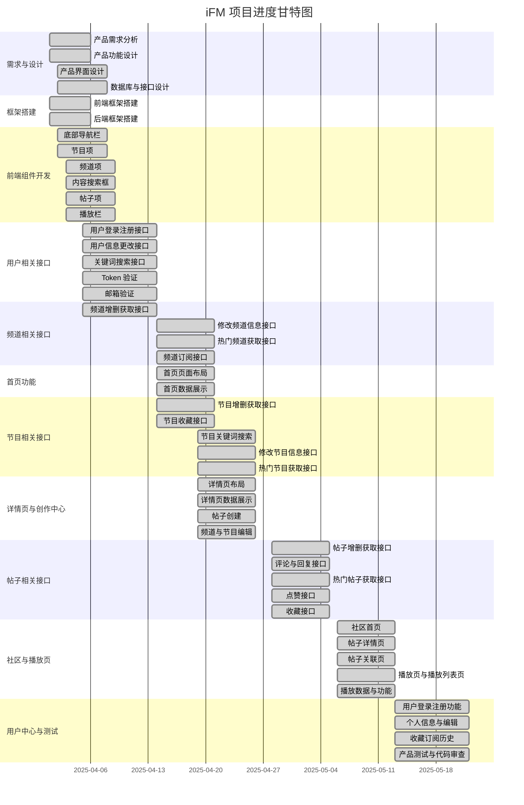

### 项目开发执行情况:(2025.4.1~2025.6.1)

> 本项目整个开发可分为三大阶段
>
> 1. 产品设计规划
> 2. 产品开发迭代
> 3. 产品测试

#### 一.产品设计规划

- 技术准备:

  > - 平台选择:移动设备平台
  > - 前端技术栈: uniapp+vue3(移动平台开发), TypeScript(静态类型语言比弱类型的js更利于团队开发与维护), Pinia(代替Vuex, 有完整ts支持, 更简单轻便, 用于全局音乐播放器开发)
  > - 后端技术栈:SpringBoot(便于后端快速开发), MySQL+Mybaits(简化数据库操作), Maven(依赖管理和项目构建)
  > - 代码规范文档: 参考阿里代码规范, 囊括前端到后端再到数据库的方方面面, 最终整理成文档

- 产品主要功能与核心流程设计:

  > 通过参考市面上同类产品**小宇宙app**,并结合对于产品背景分析, 用户需求分析等, 设计产品主要功能和核心流程(详见产品设计文档)

- 产品界面设计:

  > - 根据产品功能和流程, 使用仿真界面绘制工具modao绘制了41张界面图
  > - 对每一张界面图都写了详细的界面说明

- 产品后端设计:

  > - 设计了 14 张数据库表
  > - 设计了 55 个接口

#### 二.产品开发(2025.4.20~2025.5.15)

##### 项目开发与管理工具

- **Github**: 代码储存, 版本追踪, 协同开发
- **Apipost**: 接口测试, 生成并导出接口文档的 API 文档, 利于前后端分离开发

##### 在第一版本里, 我们完成了产品的四大主要功能, 基本实现一个完整可用的社区化播客应用:

1. **用户系统**

   > 用户注册 , 登录, 个人信息管理
   >
   > 收藏管理, 订阅管理, 收听历史管理

2. **播客节目**

   > 全局音频播放器
   >
   > 节目播放历史记录
   >
   > 热门频道与节目的推荐
   >
   > 频道分类
   >
   > 频道与节目详情查看
   >
   > 频道与节目的订阅和收藏
   >
   > 内容搜索

3. **社区中心**

   > 帖子板块分类
   >
   > 热门帖子推荐
   >
   > 帖子互动, 点赞收藏评论回复
   >
   > 内容搜索
   >
   > 社区与播客内容关联
   >
   > 关联帖子

4. **创作中心**

   > 创作内容管理(删除作品, 内容重新编辑)
   >
   > 内容创作(频道, 节目 , 帖子)

#### 三, 产品迭代(202.5.15~2025.6.1)

- 增加搜索历史记录功能
- 增加用户搜索, 查看其他用户详情功能
- 关联页新增发帖快捷入口
- 优化细节
- 修复缺陷

## TOHEAR项目团队分工

#### 张皖男:

**产品设计与规划:**

- 产品定位, 产品功能设计, 用户需求分析
- 产品界面样式设计与交互逻辑设计
- 产品后端设计

**产品开发:**

- 管理开发进度, 任务分配, 项目迭代和发布
- 前端开发
- 后端开发
- 邮箱验证功能, 客户端全局音频播放系统
- 缺陷修复

**产品测试:**

- 编写功能测试用例
- 后端接口测试
- 对项目进行测试
- 记录, 分析, 追踪缺陷

**其他:**

- 制作设计审查ppt, 产品验收ppt
- 编写产品设计文档, 进度文档等
- 后端接口文档和数据库表文档的更新
- 整理编写代码规范文档


#### 徐显舜:

**产品开发:**

- 参与前后端通信的实现
- 部分后端开发

**产品设计:**

- 产品后端接口设计
- 产品界面设计

**产品测试:**

- 编写集成测试方案
- 编写功能测试用例
- 对项目进行测试
- 记录, 分析, 追踪缺陷

**其他:**

- 产品设计审查ppt制作
- 整理编写代码规范文档

# 二、需求分析与设计 [张皖男]

## 2.1 用户画像与场景分析

详细分析目标用户群体（学生、教师、管理员），以及具体的使用场景。

## 2.2 界面原型设计

### 2.2.1 交互设计原则

1.产品核心流程图


2.功能摘要


### 页面跳转

##### 1.底部导航栏，分别进入首页（发现页），社区页，个人中心页


##### 2.节目项和频道项点击进入对应详情页，播放按钮点击播放，订阅按钮点击订阅


##### 3.首页频道分类按钮点击进入频道分类页


##### 4.播放栏，播放界面，界面详情页，频道详情页，播放列表页


##### 5.关联帖子页


##### 6.社区页，帖子详情/评论区，更多回复页


##### 7.社区页筛选帖子


##### 8.搜索结果页


##### 9.搜索结果页选择排序

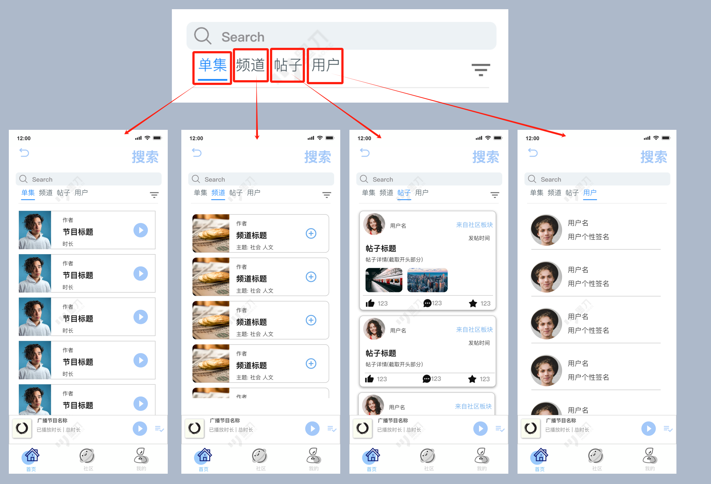

##### 10.登录注册


##### 11.个人中心，个人详情页

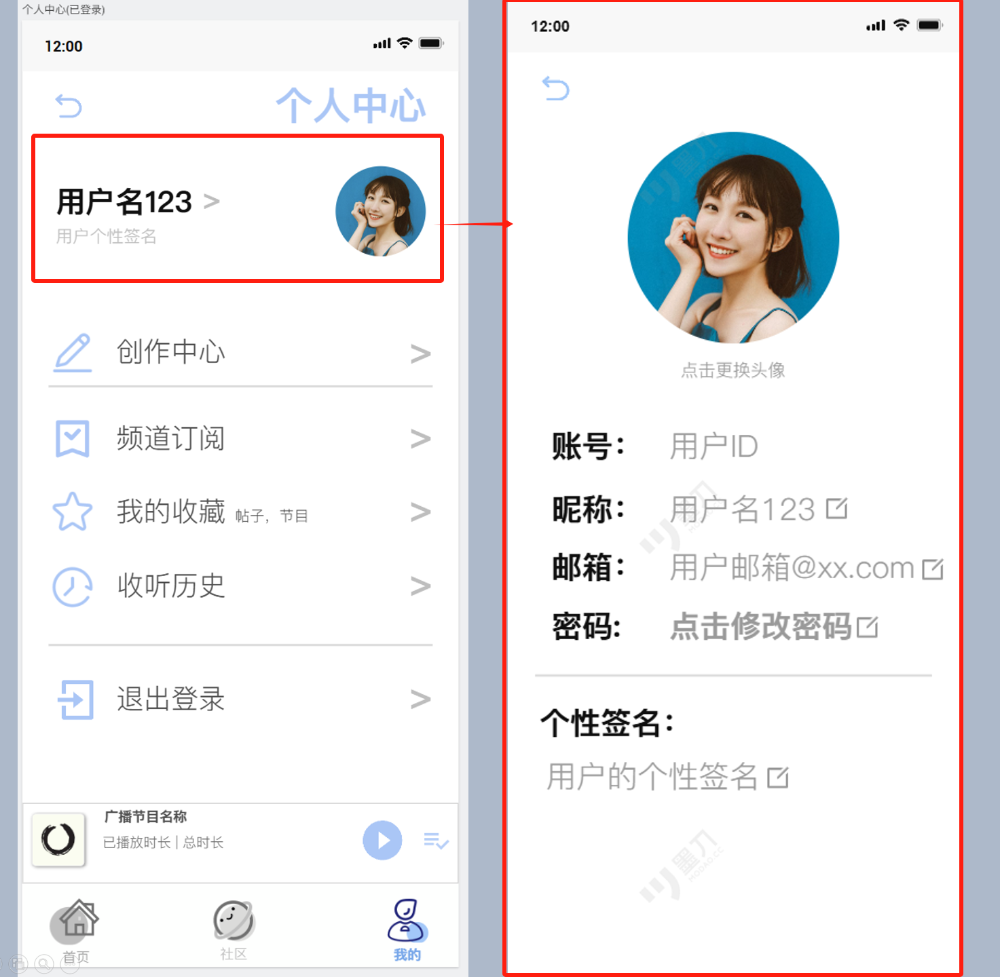

##### 12.个人详情 编辑弹窗

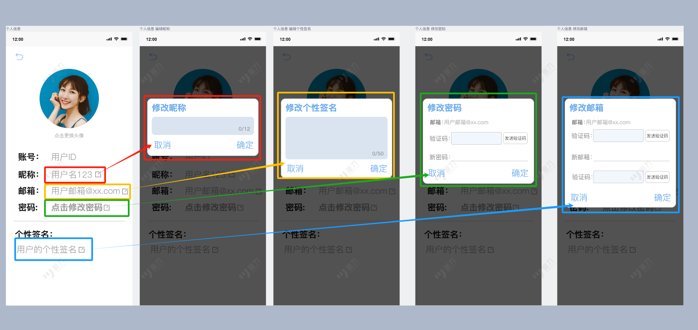

##### 13.我的收藏，频道订阅，收听历史

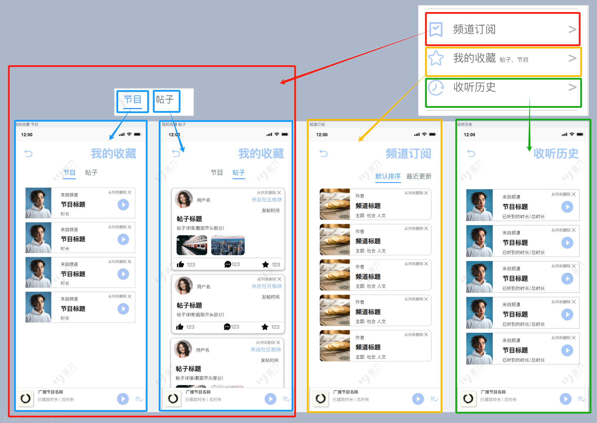

##### 14.创作中心

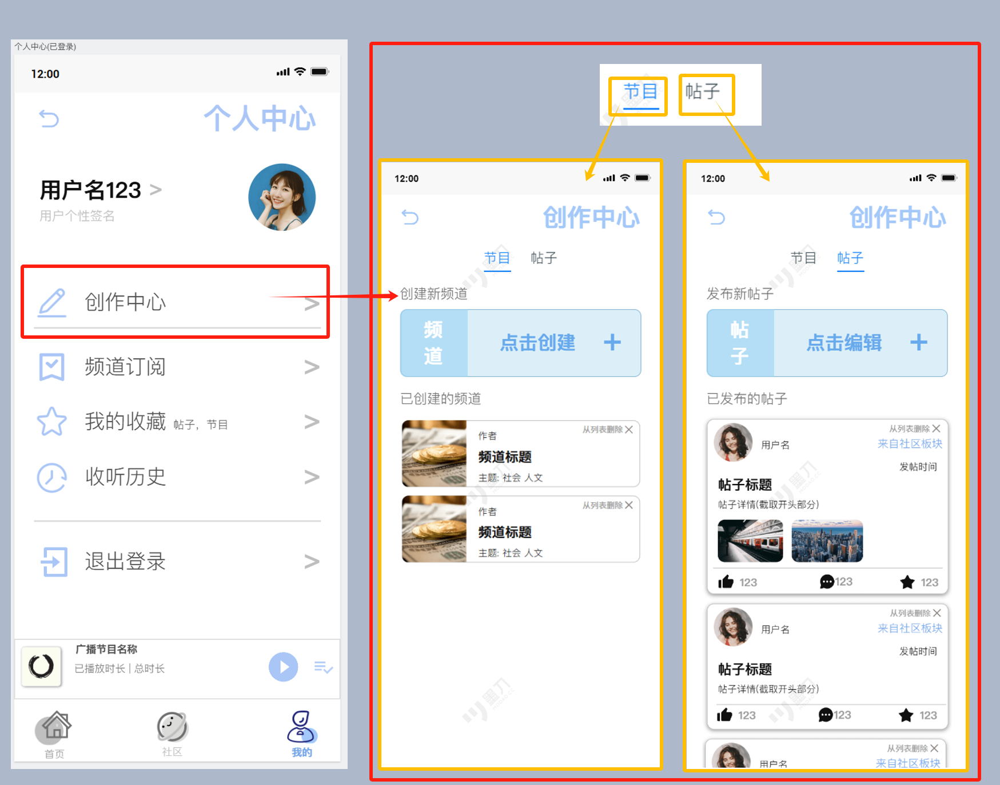

##### 15.频道创建页，可编辑频道页，节目创建页，可编辑节目页

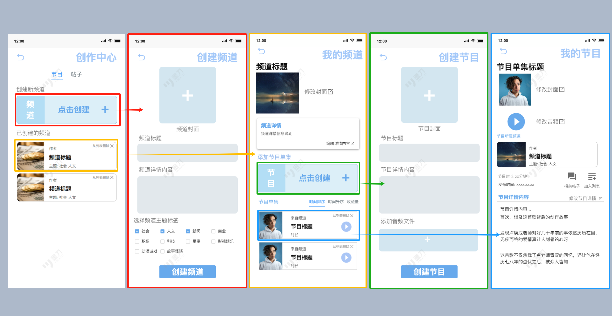

##### 16.帖子创建页，关联选择页

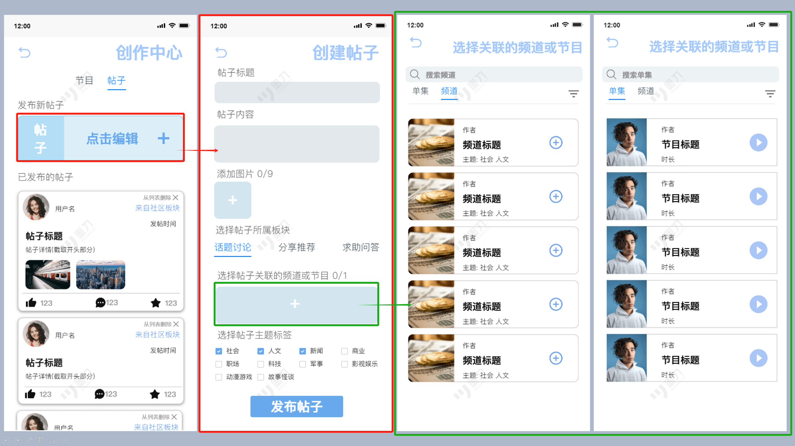

### 2.2.2 用户体验设计

- 设计清晰、直观的导航结构，保证用户能够快速找到所需功能；
- 操作流程简洁，减少用户完成任务的步骤和时间；

说明移动端交互设计的特殊考虑，如手势操作、屏幕适配、响应式设计等。

# 三、系统架构设计 [张皖男]

## 3.1 整体架构设计


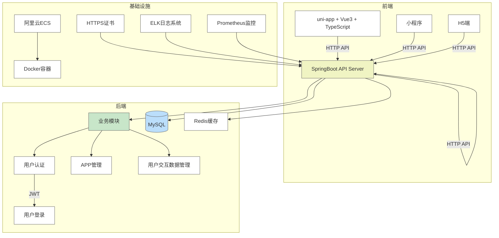


## 3.2 技术架构分层

### 3.2.1 表现层（前端）
- **模块组成** 
  包含用户管理模块（登录注册）、内容浏览模块（首页、频道）、播放模块、创作中心和个人中心。

- **模块关系** 
  各模块通过路由统一管理，支持模块间跳转和数据共享。

- **设计原因** 
  分模块设计便于功能解耦和单独维护，提升代码复用率。

- **优缺点** 
  优点：灵活、易扩展。
  缺点：初期开发成本较高，模块间接口需明确规范。

### 3.2.2 业务逻辑层（后端）
- **模块划分** 
  用户服务、内容服务、权限服务、通知服务、统计服务等。

- **业务流程设计** 
  请求由控制器接收，调用对应服务层处理业务逻辑，最终通过数据访问层操作数据库。

- **设计优势** 
  层次分明，易于单元测试和维护。

### 3.2.3 数据访问层
- **数据库设计** 
  采用关系型数据库，设计规范的ER模型，确保数据完整性和一致性。

## 3.3技术栈选择依据：

1. **服务端**：

  - **SpringBoot**：简洁的配置方式、快速开发、广泛的社区支持、与 MyBatis 无缝集成，适合构建高效的 RESTful API。
  - **MyBatis**：灵活的 SQL 映射工具，便于控制复杂查询，同时与 SpringBoot 配合良好，适合业务逻辑驱动的项目。
  - **MySQL**：稳定的关系型数据库，适合存储结构化数据，如用户信息、听书内容、评论等。
  - **Redis**：高效的缓存解决方案，用于缓存用户交互数据和提高查询性能。
  - **JWT**：无状态的用户认证方式，结合用户登录信息实现跨平台的身份验证。

2. **前端**：

  - **uni-app**：跨平台开发框架，支持 Web、App、小程序等平台的统一开发，极大提高开发效率。
  - **Vue3**：响应式数据绑定，组件化开发，提高开发效率和代码可维护性。
  - **TypeScript**：提供静态类型检查，增强代码的可维护性、可扩展性以及开发效率。
  - **Pinia**：Vue3 状态管理库，简洁的 API 设计，便于管理应用的全局状态。
  - **Vite**：快速构建工具，支持热更新、模块化开发，提高前端开发效率。

3. **移动端**：

  - **uni-app**：支持多端适配，能够同时开发 iOS、Android、H5、小程序等平台的应用，减少重复开发工作。

4. **基础设施**：

  - **Docker**：容器化部署，确保应用在不同环境下的一致性，简化开发和部署流程。
  - **阿里云ECS**：可靠的云服务器，支持项目的高效部署和扩展。
  - **HTTPS**：确保客户端与服务器之间的通信安全。
  - **ELK日志系统**：集中式日志管理，便于跟踪和分析应用的运行情况。
  - **Prometheus监控**：实时监控系统的性能，确保高可用性和性能稳定。

## 3.4关键架构设计：

1. **用户认证与授权流程**：

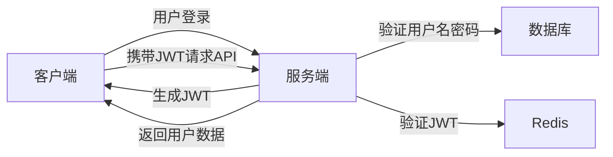

2. **数据同步与增量更新**：

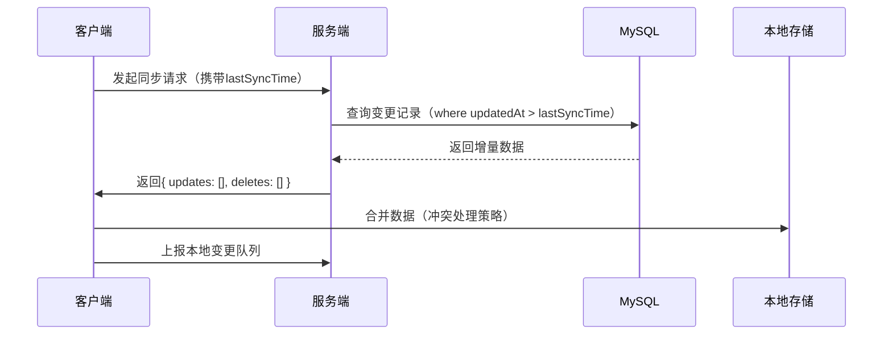

3. **性能优化措施**：
   - **缓存机制**：使用 Redis 缓存用户常用数据（如听书列表、用户信息等），减少数据库访问频率。
   - **分页加载**：对于听书列表、评论等数据，采用分页加载，提升加载速度，减少内存占用。
   - **图片懒加载**：图片资源采用懒加载，避免一次性加载大量图片，提升页面渲染速度。
   - **异步加载**：API 请求采用异步加载，减少 UI 阻塞，提高用户体验。

# 四、API设计 [张皖男、徐显舜]

## 4.1 API设计原则

在本项目中，我们采用了RESTful API设计原则，以保证接口的规范性、易用性和可扩展性，具体包括：

### 1. 资源导向设计

- API以资源为核心，使用名词表示资源（如`/users`、`/courses`）
- 每个URL代表唯一资源，便于理解和管理。

### 2. 版本控制

- 通过URL路径版本号管理接口版本，如 `/api/v1/users`。
- 保持向后兼容，支持平滑升级。

### 详细接口设计（58）

**用户信息操作相关接口(12)**

| **1接口**    | **User/getUserById**   |              |              |
| ------------ | ---------------------- | ------------ | ------------ |
| **功能说明** | 根据id获取对应用户数据 |              |              |
| **请求参数** | **参数名**             | **是否必填** | **中文说明** |
|              | user_id                | 是           | 用户id       |
| **响应参数** | **参数名**             |              | **中文说明** |
|              | user                   |              | 用户信息     |

 

| **2接口**    | **user/userLoginPassword**                                   |              |                       |
| ------------ | ------------------------------------------------------------ | ------------ | --------------------- |
| **功能说明** | 账号密码登录时,检验用户账号密码,通过则返回用户信息以实现登录 |              |                       |
| **请求参数** | **参数名**                                                   | **是否必填** | **中文说明**          |
|              | user_id                                                      | 是           | 用户id                |
|              | user_password                                                | 是           | 用户密码              |
| **响应参数** | **参数名**                                                   |              | **中文说明**          |
|              | User/error                                                   |              | 用户信息/登录失败信息 |

 

| **3接口**    | **user/getVCode** |              |                |
| ------------ | ----------------- | ------------ | -------------- |
| **功能说明** | 向邮箱发送验证码  |              |                |
| **请求参数** | **参数名**        | **是否必填** | **中文说明**   |
|              | user_email        | 是           | 邮箱           |
| **响应参数** | **参数名**        |              | **中文说明**   |
|              | Info              |              | 验证码发送结果 |


| **4接口**    | **user/userLoginEmail**                                      |              |                       |
| ------------ | ------------------------------------------------------------ | ------------ | --------------------- |
| **功能说明** | 邮箱验证登录时, 检查用户邮箱以及验证码,通过则返回用户信息以实现登录 |              |                       |
| **请求参数** | **参数名**                                                   | **是否必填** | **中文说明**          |
|              | user_email                                                   | 是           | 邮箱                  |
|              | Code                                                         | 是           | 验证码                |
| **响应参数** | **参数名**                                                   |              | **中文说明**          |
|              | User/error                                                   |              | 用户信息/登录失败信息 |

 

| **5接口**    | **user/userRegister**                                        |              |                       |
| ------------ | ------------------------------------------------------------ | ------------ | --------------------- |
| **功能说明** | 用户注册时,检查用户填入的信息是否正确可用,通过则返回用户信息 |              |                       |
| **请求参数** | **参数名**                                                   | **是否必填** | **中文说明**          |
|              | user_name                                                    | 是           | 用户昵称              |
|              | Password                                                     | 是           | 密码                  |
|              | Code                                                         | 是           | 验证码                |
|              | user_email                                                   | 是           | 邮箱                  |
| **响应参数** | **参数名**                                                   |              | **中文说明**          |
|              | User/error                                                   |              | 用户信息/注册失败信息 |

 

| **6接口**    | **user/updateUserName**                 |              |              |
| ------------ | --------------------------------------- | ------------ | ------------ |
| **功能说明** | 修改用户昵称,若新昵称未被使用则成功修改 |              |              |
| **请求参数** | **参数名**                              | **是否必填** | **中文说明** |
|              | **user_id**                             | **是**       | **用户ID**   |
|              | user_name                               | 是           | 用户新昵称   |
| **响应参数** | **参数名**                              |              | **中文说明** |
|              | Info                                    |              | 昵称修改结果 |


| **7接口**    | **user/updateUserProfile** |              |                |
| ------------ | -------------------------- | ------------ | -------------- |
| **功能说明** | 修改用户个性签名           |              |                |
| **请求参数** | **参数名**                 | **是否必填** | **中文说明**   |
|              | **user_id**                | **是**       | **用户ID**     |
|              | user_profile               | 是           | 用户新个性签名 |
| **响应参数** | **参数名**                 |              | **中文说明**   |
|              | Info                       |              | 个性签名修改结 |

| **8接口**    | **user/updateUserPassword**     |              |                |
| ------------ | ------------------------------- | ------------ | -------------- |
| **功能说明** | 修改用户密码,需要先通过邮箱验证 |              |                |
| **请求参数** | **参数名**                      | **是否必填** | **中文说明**   |
|              | **user_id**                     | **是**       | **用户ID**     |
|              | **user_email**                  | **是**       | **用户邮箱**   |
|              | **user_password**               | **是**       | **用户新密码** |
|              | **code**                        | **是**       | **验证码**     |
| **响应参数** | **参数名**                      |              | **中文说明**   |
|              | Info                            |              | 密码修改结果   |


| **9接口**    | **user/updateUserEmail**                      |              |                    |
| ------------ | --------------------------------------------- | ------------ | ------------------ |
| **功能说明** | 修改用户邮箱,需要在旧邮箱和新邮箱分别进行验证 |              |                    |
| **请求参数** | **参数名**                                    | **是否必填** | **中文说明**       |
|              | **user_id**                                   | **是**       | **用户ID**         |
|              | **user_email**                                | **是**       | **用户邮箱**       |
|              | **user_new_email**                            | **是**       | **用户新邮箱**     |
|              | **code1**                                     | **是**       | **旧邮箱的验证码** |
|              | **code2**                                     | **是**       | **新邮箱的验证码** |
| **响应参数** | **参数名**                                    |              | **中文说明**       |
|              | Info                                          |              | 邮箱修改结果       |

 

| **10接口**   | **user/updateUserPicture** |              |                    |
| ------------ | -------------------------- | ------------ | ------------------ |
| **功能说明** | 修改用户头像               |              |                    |
| **请求参数** | **参数名**                 | **是否必填** | **中文说明**       |
|              | **user_id**                | **是**       | **用户ID**         |
|              | user_picture               | 是           | 用户新头像图片文件 |
| **响应参数** | **参数名**                 |              | **中文说明**       |
|              | Info                       |              | 头像图片修改结果   |

 

| **11接口**   | **user/getUserByKeyword**      |              |                  |
| ------------ | ------------------------------ | ------------ | ---------------- |
| **功能说明** | 根据关键词模糊匹配标题搜索用户 |              |                  |
| **请求参数** | **参数名**                     | **是否必填** | **中文说明**     |
|              | **keyword**                    | **是**       | **关键词**       |
| **响应参数** | **参数名**                     |              | **中文说明**     |
|              | **user_list**                  |              | 对应用户数据列表 |

| **12接口**   | **user/verifyEmail** |              |                  |
| ------------ | -------------------- | ------------ | ---------------- |
| **功能说明** | 邮箱验证             |              |                  |
| **请求参数** | **参数名**           | **是否必填** | **中文说明**     |
|              | **user_email**       | **是**       | **用户邮箱**     |
|              | vcode                | 是           | 验证码           |
| **响应参数** | **参数名**           |              | **中文说明**     |
|              | **user_list**        |              | 对应用户数据列表 |


**广播节目信息操作相关接口(18)**

| **1接口**    | **broadcast/getBroadcastByBroadcastId** |              |                    |
| ------------ | --------------------------------------- | ------------ | ------------------ |
| **功能说明** | 根据节目id获取该单集节目的数据          |              |                    |
| **请求参数** | **参数名**                              | **是否必填** | **中文说明**       |
|              | **broadcast  _id**                      | **是**       | **节目ID**         |
| **响应参数** | **参数名**                              |              | **中文说明**       |
|              | **broadcast**                           |              | 对应单集节目的数据 |

 

| **2接口**    | **broadcast/getBroadcastByChannelId** |              |              |
| ------------ | ------------------------------------- | ------------ | ------------ |
| **功能说明** | 根据频道id获取该频道下的节目          |              |              |
| **请求参数** | **参数名**                            | **是否必填** | **中文说明** |
|              | **channel_id**                        | **是**       | **频道ID**   |
| **响应参数** | **参数名**                            |              | **中文说明** |
|              | **broadcast_list**                    |              | 对应节目列表 |

 

| **3接口**    | **broadcast/createBroadcast** |              |                      |
| ------------ | ----------------------------- | ------------ | -------------------- |
| **功能说明** | 创建节目                      |              |                      |
| **请求参数** | **参数名**                    | **是否必填** | **中文说明**         |
|              | **broadcast_title**           | **是**       | **节目标题**         |
|              | **broadcast_detail**          | **否**       | **节目详情内容**     |
|              | **broadcast_picture**         | **是**       | **节目封面图片文件** |
|              | **broadcast_audio**           | **是**       | **节目音频文件**     |
|              | **channel_id**                | **是**       | **所属频道ID**       |
| **响应参数** | **参数名**                    |              | **中文说明**         |
|              | **Info**                      |              | 节目创建结果         |

 

| **4接口**    | **broadcast/updateBroadcastPicture** |              |                      |
| ------------ | ------------------------------------ | ------------ | -------------------- |
| **功能说明** | 修改节目封面                         |              |                      |
| **请求参数** | **参数名**                           | **是否必填** | **中文说明**         |
|              | **broadcast  _id**                   | **是**       | **节目ID**           |
|              | **user_id**                          | 是           | **用户id**           |
|              | **Broadcast_picture**                | **是**       | **节目封面图片文件** |
| **响应参数** | **参数名**                           |              | **中文说明**         |
|              | **Info**                             |              | 修改结果             |

 

| **5接口**    | **broadcast/updateBroadcastDetail** |              |                  |
| ------------ | ----------------------------------- | ------------ | ---------------- |
| **功能说明** | 修改节目详情                        |              |                  |
| **请求参数** | **参数名**                          | **是否必填** | **中文说明**     |
|              | **broadcast  _id**                  | **是**       | **节目ID**       |
|              | **user_id**                         | 是           | **用户id**       |
|              | **Broadcast_detail**                | **是**       | **节目详情内容** |
| **响应参数** | **参数名**                          |              | **中文说明**     |
|              | **Info**                            |              | 修改结果         |

 

| **6接口**    | **broadcast/updateBroadcastAudio** |              |                  |
| ------------ | ---------------------------------- | ------------ | ---------------- |
| **功能说明** | 修改节目音频                       |              |                  |
| **请求参数** | **参数名**                         | **是否必填** | **中文说明**     |
|              | **broadcast  _id**                 | **是**       | **节目ID**       |
|              | **user_id**                        | 是           | **用户id**       |
|              | **broadcast_audio**                | **是**       | **节目音频文件** |
| **响应参数** | **参数名**                         |              | **中文说明**     |
|              | **Info**                           |              | 修改结果         |

| **7接口**    | **broadcast/updateBroadcastTitle** |              |              |
| ------------ | ---------------------------------- | ------------ | ------------ |
| **功能说明** | 修改节目标题                       |              |              |
| **请求参数** | **参数名**                         | **是否必填** | **中文说明** |
|              | **broadcast _id**                  | **是**       | **节目ID**   |
|              | **user_id**                        | 是           | **用户id**   |
|              | **broadcast_title**                | **是**       | **节目标题** |
| **响应参数** | **参数名**                         |              | **中文说明** |
|              | **Info**                           |              | 修改结果     |

| **8接口**    | **broadcast/getBroadcastByKeyword** |              |              |
| ------------ | ----------------------------------- | ------------ | ------------ |
| **功能说明** | 根据关键词模糊匹配标题搜索节目      |              |              |
| **请求参数** | **参数名**                          | **是否必填** | **中文说明** |
|              | **keyword**                         | **是**       | **关键词**   |
| **响应参数** | **参数名**                          |              | **中文说明** |
|              | **broadcast_list**                  |              | 对应节目列表 |

| **9接口**    | **broadcast/deleteBroadcast** |              |              |
| ------------ | ----------------------------- | ------------ | ------------ |
| **功能说明** | 删除用户创建节目              |              |              |
| **请求参数** | **参数名**                    | **是否必填** | **中文说明** |
|              | **broadcast_id**              | **是**       | **节目ID**   |
|              | **user_id**                   | 是           | **用户id**   |
| **响应参数** | **参数名**                    |              | **中文说明** |
|              | **Info**                      |              | 删除结果     |

| **10接口**   | **broadcast/getPopularBroadcast** |              |                      |
| ------------ | --------------------------------- | ------------ | -------------------- |
| **功能说明** | 获取热门节目                      |              |                      |
| **请求参数** | **参数名**                        | **是否必填** | **中文说明**         |
|              | **无**                            |              |                      |
| **响应参数** | **参数名**                        |              | **中文说明**         |
|              | **broadcast_list**                |              | 热门**节目**数据列表 |

| **11接口**   | **broadcast/checkBroadcast**                |              |              |
| ------------ | ------------------------------------------- | ------------ | ------------ |
| **功能说明** | 检查节目是否已被用户收藏,以决定收藏按钮样式 |              |              |
| **请求参数** | **参数名**                                  | **是否必填** | **中文说明** |
|              | **user_id**                                 | **是**       | **用户ID**   |
|              | **broadcast_id**                            | **是**       | **节目ID**   |
| **响应参数** | **参数名**                                  |              | **中文说明** |
|              | Info                                        |              | 检查结果     |

| **12接口**   | **broadcast/updateHistory** |              |                          |
| ------------ | --------------------------- | ------------ | ------------------------ |
| **功能说明** | 更新节目收听历史记录        |              |                          |
| **请求参数** | **参数名**                  | **是否必填** | **中文说明**             |
|              | **user_id**                 | **是**       | **用户ID**               |
|              | **broadcast_id**            | **是**       | **节目ID**               |
|              | **last_listen_duration**    | **是**       | **上次收听到的节目时长** |
| **响应参数** | **参数名**                  |              | **中文说明**             |
|              | Info                        |              | 处理结果                 |

| 13接口**     | **broadcast/deleteHistory** |              |              |
| ------------ | --------------------------- | ------------ | ------------ |
| **功能说明** | 删除节目收听历史记录        |              |              |
| **请求参数** | **参数名**                  | **是否必填** | **中文说明** |
|              | **user_id**                 | **是**       | **用户ID**   |
|              | **broadcast_id**            | **是**       | **节目ID**   |
| **响应参数** | **参数名**                  |              | **中文说明** |
|              | Info                        |              | 处理结果     |

| **14接口**   | **broadcast/changeCollection**                    |              |              |
| ------------ | ------------------------------------------------- | ------------ | ------------ |
| **功能说明** | 将节目添加收藏/取消收藏(取决于收藏表是否已有记录) |              |              |
| **请求参数** | **参数名**                                        | **是否必填** | **中文说明** |
|              | **user_id**                                       | **是**       | **用户ID**   |
|              | **broadcast_id**                                  | **是**       | **节目ID**   |
| **响应参数** | **参数名**                                        |              | **中文说明** |
|              | Info                                              |              | 处理结果     |

| **15接口**   | **broadcast/increasePlayCount** |              |              |
| ------------ | ------------------------------- | ------------ | ------------ |
| **功能说明** | 增加节目播放量                  |              |              |
| **请求参数** | **参数名**                      | **是否必填** | **中文说明** |
|              | **broadcast_id**                | **是**       | **节目ID**   |
| **响应参数** | **参数名**                      |              | **中文说明** |
|              | Info                            |              | 处理结果     |

| **16接口**   | **broadcast/getCollection**      |              |                |
| ------------ | -------------------------------- | ------------ | -------------- |
| **功能说明** | 获取用户的节目收藏表中的节目数据 |              |                |
| **请求参数** | **参数名**                       | **是否必填** | **中文说明**   |
|              | **user_id**                      | **是**       | **用户ID**     |
| **响应参数** | **参数名**                       |              | **中文说明**   |
|              | **broadcast_list**               |              | 节目项数据列表 |

| **17接口**   | **broadcast/getHistory**         |              |                |
| ------------ | -------------------------------- | ------------ | -------------- |
| **功能说明** | 获取用户收听历史记录中的节目数据 |              |                |
| **请求参数** | **参数名**                       | **是否必填** | **中文说明**   |
|              | **user_id**                      | **是**       | **用户ID**     |
| **响应参数** | **参数名**                       |              | **中文说明**   |
|              | **broadcast_list**               |              | 节目项数据列表 |

| **18接口**   | **broadcast/checkHistory**                      |              |              |
| ------------ | ----------------------------------------------- | ------------ | ------------ |
| **功能说明** | 检查节目是否在用户收听历史中,以决定起始播放时长 |              |              |
| **请求参数** | **参数名**                                      | **是否必填** | **中文说明** |
|              | **user_id**                                     | **是**       | **用户ID**   |
|              | **broadcast_id**                                | 是           | **节目id**   |
| **响应参数** | **参数名**                                      |              | **中文说明** |
|              | **lastListenDuration**                          |              | 上次收听时长 |

**频道信息操作相关接口(12)**

| **1接口***   | **channel/getChannelByChannelId** |              |              |
| ------------ | --------------------------------- | ------------ | ------------ |
| **功能说明** | 根据频道id获取对应频道数据        |              |              |
| **请求参数** | **参数名**                        | **是否必填** | **中文说明** |
|              | **channel  _id**                  | **是**       | **频道ID**   |
| **响应参数** | **参数名**                        |              | **中文说明** |
|              | **channel**                       |              | 频道数据     |

| **2接口***   | **channel/getChannelByUserId** |              |              |
| ------------ | ------------------------------ | ------------ | ------------ |
| **功能说明** | 获取用户创建的所有频道         |              |              |
| **请求参数** | **参数名**                     | **是否必填** | **中文说明** |
|              | **user_id**                    | **是**       | **用户ID**   |
| **响应参数** | **参数名**                     |              | **中文说明** |
|              | **Channel_list**               |              | 频道数据列表 |

| **3接口***   | **channel/createChannel** |              |                      |
| ------------ | ------------------------- | ------------ | -------------------- |
| **功能说明** | 创建**频道**              |              |                      |
| **请求参数** | **参数名**                | **是否必填** | **中文说明**         |
|              | **channel_title**         | **是**       | **频道标题**         |
|              | **channel  _detail**      | **否**       | **频道详情内容**     |
|              | **channel  _picture**     | **是**       | **频道封面图片文件** |
|              | **user_id**               | **是**       | **作者即用户ID**     |
|              | **hashtag_id_list**       | **是**       | **主体标签id列表**   |
| **响应参数** | **参数名**                |              | **中文说明**         |
|              | **Info**                  |              | **频道**创建结果     |

| **4接口***   | **channel /updateChannelPicture** |              |                      |
| ------------ | --------------------------------- | ------------ | -------------------- |
| **功能说明** | 修改**频道**封面                  |              |                      |
| **请求参数** | **参数名**                        | **是否必填** | **中文说明**         |
|              | **channel  _id**                  | **是**       | **频道ID**           |
|              | **channel  _picture**             | **是**       | **频道封面图片文件** |
|              | **user_id**                       | 是           | **用户ID**           |
| **响应参数** | **参数名**                        |              | **中文说明**         |
|              | **Info**                          |              | 修改结果             |

| **5接口***   | **channel/updateChannelDetail** |              |                  |
| ------------ | ------------------------------- | ------------ | ---------------- |
| **功能说明** | 修改**频道**详情                |              |                  |
| **请求参数** | **参数名**                      | **是否必填** | **中文说明**     |
|              | **channel  _id**                | **是**       | **频道ID**       |
|              | **channel_detail**              | **是**       | **频道详情内容** |
|              | **user_id**                     | 是           | **用户ID**       |
| **响应参数** | **参数名**                      |              | **中文说明**     |
|              | **Info**                        |              | 修改结果         |

| **6接口***   | **channel/updateChannelTitle** |              |              |
| ------------ | ------------------------------ | ------------ | ------------ |
| **功能说明** | 修改**频道**标题               |              |              |
| **请求参数** | **参数名**                     | **是否必填** | **中文说明** |
|              | **channel  _id**               | **是**       | **频道ID**   |
|              | **channel_title**              | **是**       | **频道标题** |
|              | **user_id**                    | 是           | **用户ID**   |
| **响应参数** | **参数名**                     |              | **中文说明** |
|              | **Info**                       |              | 修改结果     |

| **7接口***   | **channel/deleteChannel** |              |              |
| ------------ | ------------------------- | ------------ | ------------ |
| **功能说明** | 删除用户创建的频道        |              |              |
| **请求参数** | **参数名**                | **是否必填** | **中文说明** |
|              | **channel_id**            | **是**       | **频道ID**   |
|              | **user_id**               | 是           | **用户**     |
| **响应参数** | **参数名**                |              | **中文说明** |
|              | **Info**                  |              | 删除结果     |

| **8接口**    | **channel/getPopularChannel** |              |                  |
| ------------ | ----------------------------- | ------------ | ---------------- |
| **功能说明** | 获取热门频道                  |              |                  |
| **请求参数** | **参数名**                    | **是否必填** | **中文说明**     |
|              | **无**                        |              |                  |
| **响应参数** | **参数名**                    |              | **中文说明**     |
|              | **channel_list**              |              | 热门频道数据列表 |

| **9接口***   | **channel/checkChannel**                    |              |              |
| ------------ | ------------------------------------------- | ------------ | ------------ |
| **功能说明** | 检查频道是否已被用户订阅,以决定订阅按钮样式 |              |              |
| **请求参数** | **参数名**                                  | **是否必填** | **中文说明** |
|              | **user_id**                                 | **是**       | **用户ID**   |
|              | **Channel_id**                              | **是**       | **频道ID**   |
| **响应参数** | **参数名**                                  |              | **中文说明** |
|              | Info                                        |              | 检查结果     |

| **10接口***  | **channel/searchChannelByKeyWord** |              |              |
| ------------ | ---------------------------------- | ------------ | ------------ |
| **功能说明** | 根据关键词模糊匹配标题搜索频道     |              |              |
| **请求参数** | **参数名**                         | **是否必填** | **中文说明** |
|              | **keyword**                        | **是**       | **关键词**   |
| **响应参数** | **参数名**                         |              | **中文说明** |
|              | **channel_list**                   |              | 对应频道列表 |

| **11接口***  | **channel/changeSubscribe**                           |              |              |
| ------------ | ----------------------------------------------------- | ------------ | ------------ |
| **功能说明** | 将频道添加至用户订阅/取消订阅(取决于用户是否已经订阅) |              |              |
| **请求参数** | **参数名**                                            | **是否必填** | **中文说明** |
|              | **user_id**                                           | **是**       | **用户ID**   |
|              | **channel_id**                                        | **是**       | **频道ID**   |
| **响应参数** | **参数名**                                            |              | **中文说明** |
|              | Info                                                  |              | 处理结果     |

| **12接口***  | **channel/getSubscribedChannel** |              |              |
| ------------ | -------------------------------- | ------------ | ------------ |
| **功能说明** | 获取用户订阅的频道               |              |              |
| **请求参数** | **参数名**                       | **是否必填** | **中文说明** |
|              | **user_id**                      | **是**       | **用户ID**   |
| **响应参数** | **参数名**                       |              | **中文说明** |
|              | **channel_list**                 |              | **频道数据   |

**帖子数据处理相关接口(15)**

| **1接口**    | **post/getPostByPostId**   |              |              |
| ------------ | -------------------------- | ------------ | ------------ |
| **功能说明** | 根据帖子id获取对应帖子数据 |              |              |
| **请求参数** | **参数名**                 | **是否必填** | **中文说明** |
|              | **post_id**                | **是**       | **帖子ID**   |
| **响应参数** | **参数名**                 |              | **中文说明** |
|              | **post**                   |              | **帖子**数据 |

| **2接口**    | **post/getPostByUserId**     |              |              |
| ------------ | ---------------------------- | ------------ | ------------ |
| **功能说明** | 根据用户id获取用户创建的帖子 |              |              |
| **请求参数** | **参数名**                   | **是否必填** | **中文说明** |
|              | **user_id**                  | **是**       | **用户ID**   |
| **响应参数** | **参数名**                   |              | **中文说明** |
|              | **post_list**                |              | **帖子**数据 |

| **3接口**    | **post/getPostByAssociation**      |              |                           |
| ------------ | ---------------------------------- | ------------ | ------------------------- |
| **功能说明** | 根据频道或节目ID获取对应关联的帖子 |              |                           |
| **请求参数** | **参数名**                         | **是否必填** | **中文说明**              |
|              | **association_id**                 | **是**       | **频道或节目ID**          |
|              | **association_flag**               |              | **0为频道(默认) 1为节目** |
| **响应参数** | **参数名**                         |              | **中文说明**              |
|              | **post_list**                      |              | **帖子**数据              |

| **4接口**    | **post/getPostBySectionId** |              |                                               |
| ------------ | --------------------------- | ------------ | --------------------------------------------- |
| **功能说明** | 根据板块id获取对应帖子      |              |                                               |
| **请求参数** | **参数名**                  | **是否必填** | **中文说明**                                  |
|              | **section_id**              | **是**       | **板块ID(0:话题讨论 1:分享推荐  2:求助问答)** |
| **响应参数** | **参数名**                  |              | **中文说明**                                  |
|              | **post_list**               |              | **帖子**数据                                  |

| **5接口**    | **post/getPopularPost** |              |                      |
| ------------ | ----------------------- | ------------ | -------------------- |
| **功能说明** | 获取综合热门帖子        |              |                      |
| **请求参数** | **参数名**              | **是否必填** | **中文说明**         |
|              | **无**                  |              |                      |
| **响应参数** | **参数名**              |              | **中文说明**         |
|              | **post_list**           |              | 热门**帖子**数据列表 |

| **6接口**    | **post /checkPost**                         |              |              |
| ------------ | ------------------------------------------- | ------------ | ------------ |
| **功能说明** | 检查帖子是否已被用户收藏,以决定收藏按钮样式 |              |              |
| **请求参数** | **参数名**                                  | **是否必填** | **中文说明** |
|              | **user_id**                                 | **是**       | **用户ID**   |
|              | **post_id**                                 | **是**       | **帖子ID**   |
| **响应参数** | **参数名**                                  |              | **中文说明** |
|              | Info                                        |              | 检查结果     |

| **7接口**    | **post/getChannelByKeyword**   |              |              |
| ------------ | ------------------------------ | ------------ | ------------ |
| **功能说明** | 根据关键词模糊匹配标题搜索帖子 |              |              |
| **请求参数** | **参数名**                     | **是否必填** | **中文说明** |
|              | **keyword**                    | **是**       | **关键词**   |
| **响应参数** | **参数名**                     |              | **中文说明** |
|              | **post_list**                  |              | 对应帖子列表 |

| **8接口**    | **post/addCollection** |              |              |
| ------------ | ---------------------- | ------------ | ------------ |
| **功能说明** | 将帖子添加至用户收藏   |              |              |
| **请求参数** | **参数名**             | **是否必填** | **中文说明** |
|              | **user_id**            | **是**       | **用户ID**   |
|              | **post_id**            | **是**       | **帖子ID**   |
| **响应参数** | **参数名**             |              | **中文说明** |
|              | Info                   |              | 处理结果     |

| **9接口**    | **post/cancelCollection**       |              |              |
| ------------ | ------------------------------- | ------------ | ------------ |
| **功能说明** | 取消收藏,将帖子从用户收藏中删除 |              |              |
| **请求参数** | **参数名**                      | **是否必填** | **中文说明** |
|              | **user_id**                     | **是**       | **用户ID**   |
|              | **post_id**                     | **是**       | **帖子ID**   |
| **响应参数** | **参数名**                      |              | **中文说明** |
|              | Info                            |              | 处理结果     |

| **10接口**   | **post/likePost**                |              |              |
| ------------ | -------------------------------- | ------------ | ------------ |
| **功能说明** | 点赞/取消点赞帖子,更改帖子点赞量 |              |              |
| **请求参数** | **参数名**                       | **是否必填** | **中文说明** |
|              | **user_id**                      | **是**       | **用户ID**   |
|              | **post_id**                      | **是**       | **帖子ID**   |
| **响应参数** | **参数名**                       |              | **中文说明** |
|              | Info                             |              | 处理结果     |

| **11接口**   | **post/getCommentByPostId** |              |              |
| ------------ | --------------------------- | ------------ | ------------ |
| **功能说明** | 根据帖子ID获取帖子下的评论  |              |              |
| **请求参数** | **参数名**                  | **是否必填** | **中文说明** |
|              | **post_id**                 | **是**       | **帖子ID**   |
| **响应参数** | **参数名**                  |              | **中文说明** |
|              | comment_list                |              | 评论数据     |

| **12接口**   | **post/likeComment**             |              |              |
| ------------ | -------------------------------- | ------------ | ------------ |
| **功能说明** | 点赞/取消点赞评论,更改评论点赞量 |              |              |
| **请求参数** | **参数名**                       | **是否必填** | **中文说明** |
|              | **user_id**                      | **是**       | **用户ID**   |
|              | **comment_id**                   | **是**       | **帖子ID**   |
| **响应参数** | **参数名**                       |              | **中文说明** |
|              | Info                             |              | 处理结果     |

| **13接口**   | **post/addComment**  |              |                  |
| ------------ | -------------------- | ------------ | ---------------- |
| **功能说明** | 用户在帖子下添加评论 |              |                  |
| **请求参数** | **参数名**           | **是否必填** | **中文说明**     |
|              | **post_id**          | **是**       | **帖子ID**       |
|              | **user_id**          | **是**       | **用户ID**       |
|              | **comment_detail**   | **否**       | **评论文本内容** |
|              | **comment_picture**  | **否**       | **评论图片内容** |
| **响应参数** | **参数名**           |              | **中文说明**     |
|              | Info                 |              | 处理结果         |

| **14接口**   | **post/addReply** |              |                  |
| ------------ | ----------------- | ------------ | ---------------- |
| **功能说明** | 在评论下留下回复  |              |                  |
| **请求参数** | **参数名**        | **是否必填** | **中文说明**     |
|              | **user_id**       | **是**       | **用户ID**       |
|              | **comment_id**    | **是**       | **评论ID**       |
|              | **reply_detail**  | **是**       | **回复文本内容** |
| **响应参数** | **参数名**        |              | **中文说明**     |
|              | Info              |              | 处理结果         |

| **15接口**   | **post/likeReply**               |              |              |
| ------------ | -------------------------------- | ------------ | ------------ |
| **功能说明** | 点赞/取消点赞回复,更改回复点赞量 |              |              |
| **请求参数** | **参数名**                       | **是否必填** | **中文说明** |
|              | **user_id**                      | **是**       | **用户ID**   |
|              | **reply_id**                     | **是**       | **帖子ID**   |
| **响应参数** | **参数名**                       |              | **中文说明** |
|              | Info                             |              | 处理结果     |

**其他接口（1）**

| **15接口**   | **hashtag/getHashtag** |              |                  |
| ------------ | ---------------------- | ------------ | ---------------- |
| **功能说明** | 获取主题标签           |              |                  |
| **请求参数** | **参数名**             | **是否必填** | **中文说明**     |
|              | **无**                 |              |                  |
| **响应参数** | **参数名**             |              | **中文说明**     |
|              | hashtag_list           |              | 主题标签数据列表 |

## 4.4 接口测试

**测试策略**：结合单元测试和集成测试，覆盖所有关键接口。
- **测试用例设计**：
  - 正常场景测试：验证接口基本功能正确。
  - 异常场景测试：模拟错误输入、权限不足、网络异常等。
  - 边界条件测试：测试参数最大/最小值、空值等。
- **自动化测试**：
  - 使用Postman Collection和Newman实现自动化接口测试。
  - 集成CI/CD流程，实现每次代码提交自动触发接口测试。
  - 定期回归测试，确保接口变更不会破坏现有功能。

# 五、数据库设计 [张皖男]

## 5.1 数据模型设计

tohear项目中主要涉及用户、播客内容、订阅、评论、播放记录等数据。系统需要持久化的主要数据包括：

- **用户信息**：用户账号、昵称、头像、密码等基本信息。
- **播客节目**：包含节目标题、简介、作者信息、音频文件路径等。
- **订阅关系**：用户与播客的订阅状态。
- **评论信息**：用户对节目的评论内容及时间。
- **播放记录**：用户的播放历史和进度，支持续播功能。
- **缓存数据**：音频缓存、本地离线数据等。

数据库采用 **MySQL**，理由如下：

- 关系型数据结构清晰，方便管理复杂的多表关系；
- 支持事务保证数据一致性；
- 社区广泛，工具链成熟；
- 与 SpringBoot 框架无缝集成，ORM支持良好。

## 5.2 数据库架构

### 5.2.1 数据库表

1. broadcast 广播节目表

   | 列名                 | 字段类型 | 字段长度 | 是否为空 | 是否为主键 | 默认值            | 备注                    |
   | -------------------- | -------- | -------- | -------- | ---------- | ----------------- | ----------------------- |
   | broadcast_audio      | varchar  | 255      | NO       |            |                   | 广播音频文件路径        |
   | broadcast_detail     | varchar  | 255      | YES      |            |                   | 广播节目详情内容        |
   | broadcast_duration   | bigint   |          | YES      |            |                   | 广播节目时长(单位 : 秒) |
   | broadcast_id         | bigint   |          | NO       | Y          |                   | 广播节目 id             |
   | broadcast_picture    | varchar  | 255      | NO       |            |                   | 广播节目封面图片路径    |
   | broadcast_play_count | bigint   |          | NO       |            | 0                 | 广播节目播放量          |
   | broadcast_title      | varchar  | 32       | NO       |            |                   | 广播节目标题            |
   | channel_id           | bigint   |          | NO       |            |                   | 广播节目所属频道        |
   | gmt_create           | datetime |          | NO       |            | CURRENT_TIMESTAMP | 创建时间                |
   | gmt_modified         | datetime |          | NO       |            | CURRENT_TIMESTAMP | 上次更新时间            |

2. broadcast_favorite 广播节目收藏表

   | 列名                  | 字段类型 | 字段长度 | 是否为空 | 是否为主键 | 默认值            | 备注         |
   | --------------------- | -------- | -------- | -------- | ---------- | ----------------- | ------------ |
   | broadcast_favorite_id | bigint   |          | NO       | Y          |                   | 节目收藏表id |
   | broadcast_id          | bigint   |          | NO       |            |                   | 节目id       |
   | gmt_create            | datetime |          | NO       |            | CURRENT_TIMESTAMP | 创建时间     |
   | gmt_modified          | datetime |          | NO       |            | CURRENT_TIMESTAMP | 上次更新时间 |
   | user_id               | bigint   |          | NO       |            |                   | 用户id       |

3. broadcast_history 广播节目收听历史表

   | 列名                    | 字段类型 | 字段长度 | 是否为空 | 是否为主键 | 默认值            | 备注           |
   | ----------------------- | -------- | -------- | -------- | ---------- | ----------------- | -------------- |
   | broadcast_history_id    | bigint   |          | NO       | Y          |                   | 收听历史表id   |
   | broadcast_id            | bigint   |          | NO       |            |                   | 节目id         |
   | gmt_create              | datetime |          | NO       |            | CURRENT_TIMESTAMP | 创建时间       |
   | gmt_modified            | datetime |          | NO       |            | CURRENT_TIMESTAMP | 上次更新时间   |
   | history_time            | datetime |          | NO       |            |                   | 上次收听的时间 |
   | last_listening_duration | bigint   |          | NO       |            | 0                 | 上次收听时长   |
   | user_id                 | bigint   |          | NO       |            |                   | 用户id         |

4. channel 频道表

   | 列名                | 字段类型 | 字段长度 | 是否为空 | 是否为主键 | 默认值            | 备注                   |
   | ------------------- | -------- | -------- | -------- | ---------- | ----------------- | ---------------------- |
   | channel_details     | varchar  | 255      | YES      |            |                   | 频道详情内容           |
   | channel_id          | bigint   |          | NO       | Y          |                   | 频道 id                |
   | channel_picture     | varchar  | 255      | NO       |            |                   | 频道封面图片路径       |
   | channel_subscribe   | bigint   |          | NO       |            | 0                 | 频道订阅数             |
   | channel_title       | varchar  | 32       | NO       |            |                   | 频道标题               |
   | channel_update_time | datetime |          | YES      |            |                   | 频道上次更新节目的时间 |
   | gmt_create          | datetime |          | NO       |            | CURRENT_TIMESTAMP | 创建时间               |
   | gmt_modified        | datetime |          | NO       |            | CURRENT_TIMESTAMP | 上次更新时间           |
   | user_id             | bigint   |          | NO       |            |                   | 频道作者的用户 id      |

5. channel_hashtag 频道主题标签表

   | 列名               | 字段类型 | 字段长度 | 是否为空 | 是否为主键 | 默认值            | 备注         |
   | ------------------ | -------- | -------- | -------- | ---------- | ----------------- | ------------ |
   | channel_hashtag_id | bigint   |          | NO       | Y          |                   | 表id         |
   | channel_id         | bigint   |          | NO       |            |                   | 频道id       |
   | gmt_create         | datetime |          | NO       |            | CURRENT_TIMESTAMP | 创建时间     |
   | gmt_modified       | datetime |          | NO       |            | CURRENT_TIMESTAMP | 上次更新时间 |
   | hashtag_id         | bigint   |          | NO       |            |                   | 主题标签id   |
   | hashtag_name       | varchar  | 10       | YES      |            |                   | 主题标签名   |

6. channel_subscription 频道订阅表

   | 列名                    | 字段类型 | 字段长度 | 是否为空 | 是否为主键 | 默认值            | 备注         |
   | ----------------------- | -------- | -------- | -------- | ---------- | ----------------- | ------------ |
   | channel_id              | bigint   |          | NO       |            |                   | 频道id       |
   | channel_subscription_id | bigint   |          | NO       | Y          |                   | 频道订阅表id |
   | gmt_create              | datetime |          | NO       |            | CURRENT_TIMESTAMP | 创建时间     |
   | gmt_modified            | datetime |          | NO       |            | CURRENT_TIMESTAMP | 上次更新时间 |
   | user_id                 | bigint   |          | NO       |            |                   | 用户id       |

7. post 帖子表

   | association_id   | bigint   |      | YES  |      |                   | 关联的id,必须是存在的频道的id或节目id         |
   | ---------------- | -------- | ---- | ---- | ---- | ----------------- | --------------------------------------------- |
   | gmt_create       | datetime |      | NO   |      | CURRENT_TIMESTAMP | 创建时间                                      |
   | gmt_modified     | datetime |      | NO   |      | CURRENT_TIMESTAMP | 上次更新时间                                  |
   | post_association | tinyint  |      | YES  |      | 0                 | 帖子关联 0为频道 1为节目                      |
   | post_collection  | bigint   |      | NO   |      | 0                 | 帖子收藏数                                    |
   | post_comment     | bigint   |      | NO   |      | 0                 | 帖子评论数                                    |
   | post_detail      | varchar  | 255  | NO   |      |                   | 帖子详情内容                                  |
   | post_id          | bigint   |      | NO   | Y    |                   | 帖子id                                        |
   | post_like        | bigint   |      | NO   |      | 0                 | 帖子点赞数                                    |
   | post_title       | varchar  | 32   | NO   |      |                   | 帖子标题                                      |
   | section_id       | tinyint  |      | NO   |      |                   | 帖子所属板块 0:话题讨论 1:分享推荐 2:求助问答 |

8. post_picture 帖子图片内容表

   | 列名            | 字段类型 | 字段长度 | 是否为空 | 是否为主键 | 默认值            | 备注         |
   | --------------- | -------- | -------- | -------- | ---------- | ----------------- | ------------ |
   | gmt_create      | datetime |          | NO       |            | CURRENT_TIMESTAMP | 创建时间     |
   | gmt_modified    | datetime |          | NO       |            | CURRENT_TIMESTAMP | 上次更新时间 |
   | picture         | varchar  | 255      | NO       |            |                   | 图片路径     |
   | post_id         | bigint   |          | NO       |            |                   | 帖子id       |
   | post_picture_id | bigint   |          | NO       | Y          |                   | 表id         |

9. post_favorite 帖子收藏表

   | 列名             | 字段类型 | 字段长度 | 是否为空 | 是否为主键 | 默认值            | 备注         |
   | ---------------- | -------- | -------- | -------- | ---------- | ----------------- | ------------ |
   | gmt_create       | datetime |          | NO       |            | CURRENT_TIMESTAMP | 创建时间     |
   | gmt_modified     | datetime |          | NO       |            | CURRENT_TIMESTAMP | 上次更新时间 |
   | post_favorite_id | bigint   |          | NO       | Y          |                   | 帖子收藏表id |
   | post_id          | bigint   |          | NO       |            |                   | 帖子id       |
   | user_id          | bigint   |          | NO       |            |                   | 用户id       |

10. comment 评论表

    | 列名           | 字段类型 | 字段长度 | 是否为空 | 是否为主键 | 默认值            | 备注             |
    | -------------- | -------- | -------- | -------- | ---------- | ----------------- | ---------------- |
    | comment_detail | varchar  | 255      | YES      |            |                   | 评论的文本内容   |
    | comment_id     | bigint   |          | NO       | Y          |                   | 评论id           |
    | comment_like   | bigint   |          | NO       |            | 0                 | 评论的点赞数     |
    | comment_reply  | bigint   |          | NO       |            | 0                 | 评论回复数       |
    | gmt_create     | datetime |          | NO       |            | CURRENT_TIMESTAMP | 创建时间         |
    | gmt_modified   | datetime |          | NO       |            | CURRENT_TIMESTAMP | 上次更新时间     |
    | post_id        | bigint   |          | NO       |            |                   | 评论所在的帖子id |
    | user_id        | bigint   |          | NO       |            |                   | 评论者的用户id   |

11. comment_picture 评论图片表

    | 列名               | 字段类型 | 字段长度 | 是否为空 | 是否为主键 | 默认值            | 备注         |
    | ------------------ | -------- | -------- | -------- | ---------- | ----------------- | ------------ |
    | comment_id         | bigint   |          | NO       |            |                   | 评论id       |
    | comment_picture    | varchar  | 255      | NO       |            |                   | 图片路径     |
    | comment_picture_id | bigint   |          | NO       | Y          |                   | 表id         |
    | gmt_create         | datetime |          | NO       |            | CURRENT_TIMESTAMP | 创建时间     |
    | gmt_modified       | datetime |          | NO       |            | CURRENT_TIMESTAMP | 上次更新时间 |

12. reply 回复表

    | 列名         | 字段类型 | 字段长度 | 是否为空 | 是否为主键 | 默认值            | 备注           |
    | ------------ | -------- | -------- | -------- | ---------- | ----------------- | -------------- |
    | comment_id   | bigint   |          | NO       |            |                   | 评论id         |
    | gmt_create   | datetime |          | NO       |            | CURRENT_TIMESTAMP | 创建时间       |
    | gmt_modified | datetime |          | NO       |            | CURRENT_TIMESTAMP | 上次更新时间   |
    | reply_detail | varchar  | 255      | NO       |            |                   | 回复内容       |
    | reply_id     | bigint   |          | NO       | Y          |                   | 回复评论id     |
    | reply_like   | bigint   |          | NO       |            |                   | 回复的点赞数   |
    | user_id      | bigint   |          | NO       |            |                   | 回复者的用户id |

13. user 用户表

    | 列名          | 字段类型 | 字段长度 | 是否为空 | 是否为主键 | 默认值                    | 备注           |
    | ------------- | -------- | -------- | -------- | ---------- | ------------------------- | -------------- |
    | gmt_create    | datetime |          | NO       |            | CURRENT_TIMESTAMP         | 创建时间       |
    | gmt_modified  | datetime |          | NO       |            | CURRENT_TIMESTAMP         | 上次更新时间   |
    | user_email    | varchar  | 255      | NO       |            |                           | 用户邮箱(唯一) |
    | user_id       | bigint   |          | NO       | Y          |                           | 用户账号(唯一) |
    | user_name     | varchar  | 30       | NO       |            |                           | 用户昵称(唯一) |
    | user_password | varchar  | 30       | NO       |            |                           | 用户密码       |
    | user_picture  | varchar  | 255      | NO       |            |                           | 用户头像路径   |
    | user_profile  | varchar  | 50       | YES      |            | 这个人很神秘,什么都没有写 | 个人简介       |

14. hashtag 主题标签表

| 列名         | 字段类型 | 字段长度 | 是否为空 | 是否为主键 | 默认值            | 备注         |
| ------------ | -------- | -------- | -------- | ---------- | ----------------- | ------------ |
| gmt_create   | datetime |          | NO       |            | CURRENT_TIMESTAMP | 创建时间     |
| gmt_modified | datetime |          | NO       |            | CURRENT_TIMESTAMP | 上次更新时间 |
| hashtag_id   | bigint   |          | NO       | Y          |                   | 主题标签id   |
| hashtag_name | varchar  | 10       | NO       |            |                   | 主题标签名   |

表设计重点考虑：

- 主键统一使用自增ID，便于索引优化；
- 外键关联保证数据完整性，如`subscriptions.user_id`关联`users.user_id`；
- 支持多对多关系，如用户和播客的订阅。

### 5.2.2 索引设计

主键索引：所有表均设主键索引。

外键字段索引：如`subscriptions.user_id`和`subscriptions.podcast_id`设联合索引，优化订阅查询。

常用查询字段索引：如`comments.podcast_id`用于快速查询评论列表。

播放记录表`user_id`和`podcast_id`建立复合索引，加快播放记录的检索。

### 5.2.3 数据库性能优化

使用合理的索引减少查询时间；

对频繁更新的表进行合理分区或分表（如播放记录）；

采用连接池技术减少连接开销；

视情况使用缓存（Redis等）存储热点数据，如用户订阅列表；

定期清理过期数据，保持表的健康状态。

## 5.3 数据访问层实现

后端采用 **Spring Data JPA** 作为ORM框架，实现实体类与数据库表的映射；

通过接口定义实现数据访问层（DAO），利用Spring Boot自动配置简化开发；

实现分页查询、条件查询等复杂操作，保证系统响应速度；

使用事务管理确保数据操作的原子性和一致性。

# 六、前端实现 [徐显舜]

## 6.1 技术栈与开发环境

本项目前端采用 **uni-app** 框架，支持多端（微信小程序、Android、iOS、Web）统一开发，提升开发效率。  
开发工具主要使用 **HBuilderX**，支持一键调试与打包。构建流程包括代码编写、模拟器预览、真机调试及最终发布。  
技术栈包括：Vue.js、uni-app组件库、Vuex状态管理等。

项目结构划分：

```
tohear_clent/
├── vite/                    # Vite构建工具
├── node_modules/            # 项目依赖
└── src/                     # 源代码目录
    ├── assets/
    │   └── iconfont.css     # 图标字体
    ├── components/          # 公共组件
    │   ├── broadcast-item/  # 广播组件
    │   ├── channel-item/    # 频道组件
    │   ├── comment-item/    # 评论组件
    │   ├── drop-down/       # 下拉组件
    │   ├── edit-wind/       # 编辑窗口
    │   ├── head-generic/    # 通用头部
    │   ├── my-button/       # 自定义按钮
    │   ├── my-head/         # 个人中心头部
    │   ├── player-bar/      # 播放器控制条
    │   ├── popupwindow/     # 弹窗组件
    │   ├── post-head/       # 帖子头部
    │   ├── post-interaction/# 帖子交互
    │   ├── post-item/       # 帖子项
    │   ├── reply-item/      # 回复项
    │   ├── search-box/      # 搜索框
    │   ├── sort-method-box/ # 排序选择
    │   ├── tabbar/          # 底部导航
    │   ├── tags-tabs/       # 标签页
    │   └── useritem/        # 用户项
    ├── pages/               # 页面目录
    │   ├── broadcast/       # 广播页
    │   ├── channel/         # 频道页
    │   ├── community/       # 社区页
    │   ├── creation/        # 创作页
    │   ├── index/           # 首页
    │   ├── login-register/  # 登录注册
    │   ├── my/              # 个人中心
    │   ├── player/          # 播放器
    │   ├── search-pages/    # 搜索页
    │   ├── test/            # 测试页
    │   └── user/            # 用户页
    ├── request/             # 请求封装
    │   ├── apis.ts          # API接口
    │   └── index.ts         # 请求核心
    ├── static/              # 静态资源
    │   └── tab_icons/       # 标签图标
    │       ├── bg.png       # 背景图
    │       └── logo.png     # Logo
    ├── stores/              # 状态管理
    │   ├── base.ts          # 基础Store
    │   ├── counter.ts       # 计数器Store
    │   ├── player-副本.ts   # 播放器备份
    │   ├── player.ts        # 播放器状态
    │   └── user.ts          # 用户状态
    ├── styles/              # 样式文件
    │   └── tailwind.css     # Tailwind样式
    ├── uni_modules/         # uni-app模块
    ├── utils/               # 工具函数
    │   ├── broadcastSort.ts # 广播排序
    │   ├── channelSort.ts   # 频道排序
    │   ├── checkPassword.ts # 密码验证
    │   ├── commentSort.ts   # 评论排序
    │   ├── durationFormatting.ts # 时长格式化
    │   ├── initPlayer.ts    # 播放器初始化
    │   ├── logOut.ts        # 登出逻辑
    │   ├── numConversion.js # 数字转换
    │   ├── postSort.ts      # 帖子排序
    │   └── timeChange.ts    # 时间转换
    ├── App.vue              # 根组件
    ├── env.d.ts             # 环境类型
    ├── main.ts              # 主入口
    ├── manifest.json        # 应用配置
    ├── pages.json           # 路由配置
    ├── shime-uni.d.ts       # uni类型声明
    ├── uni.scss             # 全局样式
    ├── .gitignore           # Git配置
    └── index.html           # HTML入口
```

## 6.2 核心功能模块实现

### 6.2.1 用户管理模块

功能涵盖登录、注册、个人信息查看与修改。  
- 使用表单验证确保输入合法性，密码采用前端简单加密后传输。  
- 登录时通过调用后端API验证用户身份，返回token进行后续鉴权。  
- 优点：接口清晰，前后端分离，用户体验良好；缺点：依赖网络，首次加载可能稍慢。  
- 实现难点：异步请求的状态管理和错误处理。  

### 6.2.3 数据展示模块


### **1. 采用的核心技术**

#### **(1) 前端框架：Vue.js + 自定义组件库**

技术栈

- 基于 **Vue 3**（`<template>`语法）
- 使用类似 **uView UI** 的自定义组件库（`uv-text`、`uv-avatar`、`uv-image`等）
- 状态管理：Vuex 或 Pinia（图中未展示，但需管理`channelDetail`数据）

#### **(2) 关键实现特性**

|      技术点      |                            说明                            |
| :--------------: | :--------------------------------------------------------: |
|  **组件化开发**  | 通过`uv-*`系列组件封装通用功能（如头像、文本、图片懒加载） |
| **动态数据绑定** | `:text="channelDetail.channelTitle"` 实现数据驱动视图更新  |
|  **响应式布局**  |   `width="100%"` + `mode="aspectFill"` 适配不同屏幕尺寸    |
|   **性能优化**   |      图片懒加载（`lazy-load="true"`）减少首屏加载压力      |

### **2. 优缺点分析**

#### **优点**

|      优势      |                         说明                          |
| :------------: | :---------------------------------------------------: |
|  **高复用性**  | 自定义组件（如`uv-text`）可在全项目复用，减少重复代码 |
|  **维护便捷**  |       模块化结构清晰，数据与视图分离，便于迭代        |
|  **性能优化**  |   懒加载、样式隔离（`customStyle`）提升页面渲染效率   |
| **开发效率高** |    组件库提供现成功能（如多行文本截断`lines="3"`）    |

#### **缺点**

|      劣势      |                           说明                           |
| :------------: | :------------------------------------------------------: |
| **框架强依赖** |            深度绑定Vue生态，迁移或替换成本高             |
|  **学习成本**  |   需掌握自定义组件库的API（如`uv-image`的`mode`属性）    |
| **灵活性受限** | 组件库功能固定，特殊需求需二次开发（如自定义懒加载逻辑） |

## 6.3 性能优化

采用代码分包和按需加载减少首屏加载时间。  
- 优化内存管理，避免内存泄漏。  
- 使用请求合并、缓存和重试机制，提升网络请求效率和稳定性。  
- 通过调试工具分析性能瓶颈，针对性优化。

## 6.4 兼容性处理

- **多设备适配** 
    使用响应式布局和弹性设计，保证页面在手机、平板、PC等多种设备上均能良好显示。通过 `flexbox` 和 `media queries` 动态调整布局。
  - **跨平台支持** 
    利用 uni-app 框架的多端编译能力，统一管理代码，iOS、H5等多个平台，避免重复开发。
  
  - **浏览器兼容性** 
    采用现代Web标准，兼容主流浏览器（Chrome、Safari、Firefox、Edge等）。对不支持的API使用 polyfill 进行兼容处理。
  
  - **版本兼容** 
    针对不同系统版本（如 Android 7 及以上，iOS 11 及以上）测试功能表现，调整不兼容功能或提示用户更新版本。
  
  - **性能兼容** 
    针对低性能设备优化资源加载，减少动画和复杂计算，保证流畅体验。
  
  - **异常处理** 
    增加兼容性异常捕获机制，避免因设备差异导致的程序崩溃，提升稳定性。

# 七、后端实现 [张皖男]

## 7.1 技术栈与架构

后端采用Spring Boot框架，基于Java语言开发，理由包括：

- **成熟稳定**：Spring Boot生态完善，社区活跃，支持快速开发。
- **模块化**：易于分层设计，方便业务逻辑划分和维护。
- **丰富组件**：内置安全框架（Spring Security）、数据访问（Spring Data JPA）、缓存支持等。
- **易扩展性**：支持微服务架构，方便未来扩展。

- 技术栈：Spring Boot + MyBatis Plus

- 项目结构：

  ```java
   tohear_server/
  ├── .idea/                   # IDEA配置文件
  ├── .mvn/                   # Maven包装器
  ├── src/
  │   ├── main/
  │   │   ├── java/
  │   │   │   └── com.pxx.ifmserver/
  │   │   │       ├── config/          # 配置类
  │   │   │       │   ├── CorsConfig   # 跨域配置
  │   │   │       │   └── WebConfig    # Web配置
  │   │   │       ├── controller/      # 控制器层
  │   │   │       │   ├── BroadcastController
  │   │   │       │   ├── ChannelController
  │   │   │       │   ├── CommentController
  │   │   │       │   ├── EmailController
  │   │   │       │   ├── PostController
  │   │   │       │   ├── ReplyController
  │   │   │       │   ├── SearchHistoryController
  │   │   │       │   ├── ServerController
  │   │   │       │   └── UserController
  │   │   │       ├── entity/          # 数据库实体
  │   │   │       │   ├── Broadcast
  │   │   │       │   ├── BroadcastFavorite
  │   │   │       │   ├── BroadcastHistory
  │   │   │       │   ├── Channel
  │   │   │       │   ├── Comment
  │   │   │       │   ├── Post
  │   │   │       │   ├── Reply
  │   │   │       │   ├── SearchHistory
  │   │   │       │   └── User
  │   │   │       ├── dto/             # 数据传输对象
  │   │   │       │   ├── CommentDTO
  │   │   │       │   └── HashTag
  │   │   │       ├── vo/              # 视图对象
  │   │   │       │   ├── BroadcastItemVO
  │   │   │       │   ├── BroadcastVO
  │   │   │       │   ├── ChannelItemVO
  │   │   │       │   ├── ChannelVO
  │   │   │       │   ├── CommentVO
  │   │   │       │   ├── PostVO
  │   │   │       │   └── ReplyVO
  │   │   │       ├── mapper/          # MyBatis映射器
  │   │   │       │   ├── BroadcastMapper
  │   │   │       │   ├── ChannelMapper
  │   │   │       │   ├── CommentMapper
  │   │   │       │   ├── PostMapper
  │   │   │       │   ├── ReplyMapper
  │   │   │       │   ├── SearchHistoryMapper
  │   │   │       │   └── UserMapper
  │   │   │       ├── result/          # 统一返回结果
  │   │   │       │   ├── Result
  │   │   │       │   └── ResultCodeEnum
  │   │   │       ├── service/         # 服务层
  │   │   │       │   └── impl/        # 服务实现
  │   │   │       │       ├── BroadcastService
  │   │   │       │       ├── ChannelService
  │   │   │       │       ├── CommentService
  │   │   │       │       ├── PostService
  │   │   │       │       ├── ReplyService
  │   │   │       │       ├── SearchHistoryService
  │   │   │       │       └── UserService
  │   │   │       └── utils/           # 工具类
  │   │   │           ├── EmailUtil
  │   │   │           ├── FileUtils
  │   │   │           ├── TokenUtil
  │   │   │           ├── VCodeUtil
  │   │   │           └── IFmServerApplication
  │   │   └── resources/
  │   │       ├── static/              # 静态资源
  │   │       │   └── images/
  │   │       │       ├── channel/    # 频道图片
  │   │       │       │   └── D.png
  │   │       │       └── user.head/  # 用户头像
  │   │       │           ├── 6_1732262627.png
  │   │       │           ├── 7_1732262834.png
  │   │       │           └── D.png
  │   │       ├── application.properties # 应用配置
  │   │       └── mybatis-config.xml   # MyBatis配置
  │   └── test/                       # 测试代码
  ├── target/                         # 构建输出
  │   ├── .gitattributes
  │   ├── .gitignore
  │   ├── mvnw                        # Maven包装器脚本
  │   ├── mvnw.cmd
  │   └── pom.xml                     # Maven项目配置
  └── pom.xml                         # 主POM文件
  
  ```

# 八、系统测试 [张皖男]

- 单元测试（JUnit）：
  - 测试服务层、工具类逻辑正确性
- 接口测试：
  - 使用 Postman 逐一验证接口请求与返回数据
- 前端测试：
  - 手动测试主流程：登录 → 播客浏览 → 播放 → 评论/收藏

# 九、性能优化 [徐显舜]

### 页面加载优化

移除无效组件和冗余样式文件，减少初始体积。

### 资源优化

所有图标和 UI 元素使用矢量图（SVG）或 WebP 格式压缩图像资源。

### 10.2.1 数据库优化

分多个表输入数据

# 十、功能展示 [徐显舜]

## 10.1系统演示

项目演示视频:见 docs中视频

## 10.2 用户体验测试

团队对系统进行了体验测试，测试方式为：

- 功能测试；

### ✅ 反馈总结如下：

| 评价维度   | 用户反馈                         |
| ---------- | -------------------------------- |
| 界面美观度 | 简洁清晰，结构清晰，颜色搭配良好 |
| 操作流畅性 | 页面跳转速度快，响应及时         |
| 功能实用性 | 实用性强                         |
| 使用难易度 | 功能入口清晰，易上手             |

## 10.1 性能测试结果

测试结论，系统性能表现稳定，接口响应时间在可接受范围内，服务器负载正常。

# 十一、项目管理与协作 [徐显舜]

## 11.1 开发流程

本项目采用了**敏捷开发方法论**，以小步快跑、快速迭代的方式推进开发进度。开发流程主要分为以下几个阶段：

1. **需求分析阶段**：明确产品目标和核心功能，绘制 ER 图与原型图。
2. **任务拆解阶段**：将项目划分为前端、后端和数据库三个部分，并细化为多个具体模块。
3. **迭代开发阶段**：
   - 每周进行功能划分和任务分配；
   - 每日或每两日同步开发进度，进行问题讨论与解决；
   - 每个小模块完成后进行集成测试与验收。
4. **部署与调试阶段**：前后端联调，进行 bug 修复与功能补充，最终部署运行环境。

这种灵活的开发方式使得项目能够快速响应问题，提升团队协同效率。

## 11.2 协作工具

为保证高效协作与项目可控性，团队使用了多种协作工具：

- **版本控制工具：Git + GitHub Desktop**
  - 通过 Git 进行版本管理；
  - 每位成员负责不同模块，定期 push/pull 合并代码；
  - 采用分支策略（如 dev 分支、feature 分支）以避免冲突。

## 11.3 质量保证

为确保代码质量与系统稳定性，团队采用了以下质量控制措施：

- **代码 Review**：
  - 每个模块提交后，至少由另一名成员进行代码审查；
  - 审查内容包括代码规范、逻辑正确性、重复/冗余代码等。
- **功能测试**：
  - 各模块开发完成后，进行功能测试确保其符合需求；
  - 联调阶段进行回归测试，防止修改引入新 bug。
- **统一编码规范**：
  - 前端遵循 uni-app 的组件开发规范；
  - 后端遵循 Spring Boot 的标准结构与 RESTful API 风格；
  - 使用 Prettier / IDEA 格式化工具保持代码风格一致。

# 十二、成果与交付物 [张皖男]

## 12.1 项目交付清单

- 前端代码: [tohear-app-web](https://github.com/2203Group7/tohear-app-web)项目
- 后端代码: [tohear-api-springboot](https://github.com/2203Group7/tohear-api-springboot)项目  
- 数据库脚本: [2203Group7/database](https://github.com/2203Group7/database)API文档: docs/api/目录
- 项目演示视频: docs/期末文档
- 详细界面说明文档: docs/design

# 十三、总结与展望 [徐显舜]

## 13.1 项目总结

本项目基于 **uni-app + Spring Boot + MySQL** 构建，实现了一个听书类小程序的前后端分离架构。团队围绕用户登录、音频播放、用户信息管理、内容展示等核心功能进行了开发和优化。项目总体按计划完成，系统结构清晰，功能模块划分明确，具备良好的可扩展性与可维护性。

主要成果包括：

- 完成前端页面的搭建与基本交互逻辑实现；
- 搭建稳定的后端服务，支持基本的数据处理；
- 设计并实现 MySQL 数据库结构，完成数据存储与管理；
- 实现了基础的用户登录、内容展示、播放记录等核心功能。

## 13.2 技术收获

在项目开发过程中，团队成员在以下方面取得了显著提升：

- 熟悉并掌握了 **uni-app** 跨端开发框架，了解其组件化设计与页面跳转机制；
- 提升了对 **Spring Boot** 框架的理解，能够完成接口设计、参数校验和服务编写；
- 掌握了 **MySQL 数据库建模、查询优化与数据交互** 技能；
- 学习并实践了 **前后端分离开发流程**，包括接口联调、跨域处理等；
- 团队协作能力与项目管理能力显著提升，具备较强的问题解决能力。

## 13.3 问题与反思

项目过程中也遇到了一些挑战与问题，包括但不限于：

- **前后端接口不一致**：初期缺乏统一 API 文档，导致接口传参错误；
  - **解决方案**： 进行接口文档管理，确保前后端对齐；
- **开发进度偏差**：部分模块开发时间超出预期；
  - **解决方案**：后期通过每日站会和任务分配机制进行进度追踪；
- **数据库设计初期不合理**：字段设计不规范，冗余较多；
  - **解决方案**：通过反复优化 ER 图，重构数据表结构，提升数据一致性与查询效率。

经验教训：**早期设计非常关键，应在开发前充分沟通，确定标准和接口规范。**

## 13.4 未来展望

当前项目仅实现了基础的音频内容管理与用户功能，后续可以进一步拓展：

- 引入 **AI 推荐算法**，实现个性化内容推送；
- 支持 **内容创作者入驻与上传音频功能**，构建平台生态；
- 实现 **后台管理系统**，提供数据统计、内容审核、用户管理等功能；
- 适配 **小程序平台发布**（如微信、支付宝、抖音）并进行用户测试。

## 13.5 商业化前景

随着内容消费持续增长，本项目具备一定的商业价值和市场潜力：

- **目标用户**：关注音频内容消费的年轻群体、通勤用户、泛知识类内容爱好者；
- **商业模式**：可探索广告变现、会员订阅、知识付费、内容打赏等；
- **差异化优势**：聚焦小众内容、强调个性推荐、提升用户体验；
- **合作方向**：可与音频内容创作者、MCN 机构、知识平台等开展合作；
- **技术壁垒**：前后端分离、跨端支持、音频处理能力为系统的核心优势。


**附录**

## 附录A：详细API文档
## 附录B：数据库表结构
## 附录C：开发阶段进度计划与执行
## 附录D：产品界面详细说明
